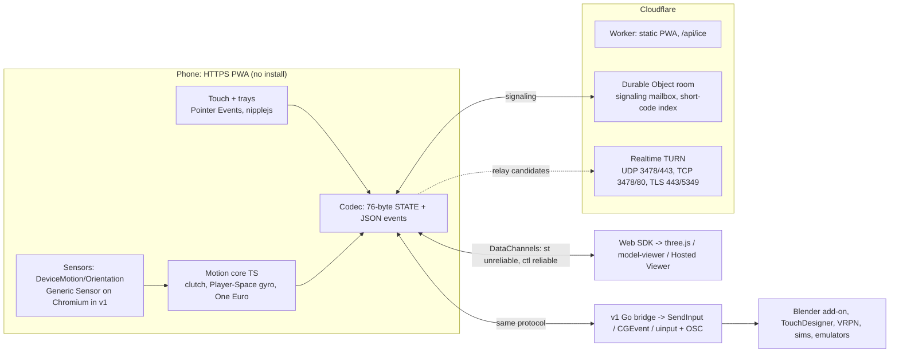
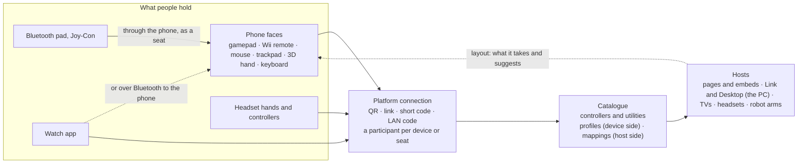

# ob-pal: phone as a 3D remote (plan, 2026-09-25)

> **Status (2026-09-25):** decided: solo build, web-3D-first launch, MIT license (matching Blackboxes). The MVP vertical slice is live at https://obpal.blackboxes.net: pairing, the Rotate and Point modes, the trackpad, trays, and the hosted viewer. Still to do before relay coverage: a TURN key. The wire protocol is written up in [spec/PROTOCOL.md](spec/PROTOCOL.md).
>
> **2026-09-26:** the controller is an offline-capable PWA (service worker, versioned cache), and a phone that paired once with ob.Pal Link reconnects over the LAN through a **direct code** with no server involved (PROTOCOL.md §2a). Connecting is front-loaded: the phone's offer is built while signaling connects, the extension keeps its link warm from browser start, and both sides give the service 1.5 s before switching to the direct path.

> Vision: scan once and the phone becomes a remote for 3D objects and on-screen navigation. It works through the gyroscope, swipe/trackpad gestures and button trays, on as many phone, OS and screen combinations as possible, and is built from existing tech.

## TL;DR: the easiest path with the widest reach

1. **Phone = a web app (PWA) on one public HTTPS origin, opened by scanning a QR code.** Nothing to install.
   - Full support: iOS/iPadOS 16.4+ and Android 10+. That is about 98% of active phones.
   - Best-effort: iOS 15 and Android 7–9.
2. **Link = WebRTC DataChannel.** An unreliable channel carries motion at 60 Hz, and a reliable channel carries buttons.
   - Signaling goes through a Cloudflare Worker + Durable Object.
   - Cloudflare TURN (UDP/TCP/TLS 443) is always configured. Sessions therefore work on home Wi-Fi, guest Wi-Fi with client isolation, cellular and UDP-blocked networks.
3. **Why not a LAN web server:**
   - Motion sensors need HTTPS (WebKit and Chromium).
   - An HTTPS page can't open `ws://` to a LAN IP in Safari, and Chrome 147+ puts a permission prompt in front of it.
   - WebRTC is the one prompt-free path from a public page to a LAN host today.
4. **Hosts, three tiers, one protocol:**
   - (a) **JS SDK** for browser 3D apps (three.js, model-viewer, Babylon). Zero install. Also covers ChromeOS, Quest, Vision Pro and modern TVs.
   - (b) **Small native bridge** (Go + pion) for desktop apps. It injects OS mouse/keyboard input and sends OSC to a Blender add-on for exact 1:1 rotation.
   - (c) **Later:** legacy protocol emitters (VRPN, opentrack, DSU, TUIO, MIDI), virtual HID devices, and an Android-only Bluetooth-HID "Direct mode".
5. **Input:**
   - Clutched gyro: hold a pad to rotate the object, or use the phone as an air pointer.
   - Trackpad gestures: orbit, pan, pinch-zoom, twist.
   - Button trays defined in JSON.
6. **We reuse:**
   - browser WebRTC and WebCrypto, Cloudflare DO/TURN, pion
   - GamepadMotionHelpers "Player Space" gyro math, One Euro filter
   - nipplejs, camera-controls, uqr
7. **MVP is web-only: about 5 weeks for 2 engineers, about 7 solo.** The native bridge is v1.

---

## 1. Goals & MVP targets

| Metric | Target |
|---|---|
| First scan → object moving (includes the iOS motion prompt) | ≤10 s median |
| Resume after a 30 s screen lock | ≤3 s p90 |
| Sessions reaching control on home, AP-isolated, cellular and UDP-blocked networks | ≥97% |
| Phone glass → host receive, LAN (in-band telemetry) | ≤35 ms p95 |
| Motion-to-photon, LAN, 60 Hz display | ≤65 ms p50 |
| Motion-to-photon, relayed via TURN | ≤110 ms p50 |
| Drift, clutch held 60 s | <1.5° |
| Unauthenticated input accepted | 0 |

## 2. Architecture



**Principles:**
- The phone never knows which kind of host it is talking to.
- Adding a host type never changes the phone.
- Motion is interpreted once, on the phone, in one TypeScript module. Deploying the PWA updates tuning for every phone.
- Hosts only interpolate to their frame rate.

## 3. Reuse vs build

| Need | Reused | We build |
|---|---|---|
| Transport, NAT traversal, encryption | Browser WebRTC (ICE/DTLS/SCTP), pion (bridge), Cloudflare TURN | Link state machine, reconnect |
| Signaling | Durable Objects with WebSocket Hibernation | ~150 LOC room logic |
| Sensor fusion | OS fusion behind the W3C APIs | Normalization, quaternion + screen-angle compensation |
| Gyro feel | GamepadMotionHelpers (MIT, algorithm), One Euro filter (BSD-3) | TS port, mode mappers |
| Touch UI | Pointer Events, nipplejs (MIT) | Gesture recognizer, tray renderer |
| QR | Phone camera app, uqr (MIT) | – |
| 3D control | three.js, camera-controls (MIT), model-viewer | Adapters |
| OS input (v1) | SendInput, CGEventPost, uinput/libei | Thin injectors, per-app profiles |
| Legacy ecosystems (v1+) | OSC, VRPN JsonNet, opentrack, DSU, TUIO, MIDI specs | Emitters (20–150 LOC each) |

**Not used, and why:**

| Excluded | Why |
|---|---|
| Plain-HTTP LAN pages (the HappyFunTimes approach) | No sensors |
| `https→ws://LAN` | Blocked in Safari, prompted in Chrome |
| Plex-style LAN certificates | DNS-rebind breakage |
| ViGEmBus | Archived 2023-11-02 |
| libdatachannel for the bridge | Cannot do TURN over TLS |
| hammer.js, gyronorm, Full Tilt, the original simple-peer | Dead |
| AirConsole, KDE Connect and Unified Remote protocols | Closed, GPL, or native on both ends |

## 4. Pairing & connection

**QR pairing (primary):**
1. **Host shows a QR code.** The host is the SDK page or Hosted Viewer (the bridge from v1).
   - QR content: `https://<origin>/p#<S>.<fpH>`.
   - `S` is 128 random bits and `fpH` is the host's DTLS certificate fingerprint. Both sit in the URL fragment, which never reaches a server.
   - Room id = `H(S)`.
2. **Phone scans with its Camera app**, which opens the default browser.
   - The PWA strips the fragment from the URL.
   - It warms up signaling, TURN credentials and ICE before the user taps anything.
   - It detects in-app browsers (Instagram, Facebook and similar) and offers "Open in Safari/Chrome". Touch-only mode is always available.
3. **Motion permission:**
   - On load, try `requestPermission()` without a gesture. iOS remembers a grant per origin until the browser is closed.
   - If a prompt is needed, show **one "Tap to start" button**. In a single click handler:
     1. Call `DeviceMotionEvent.requestPermission()` and `DeviceOrientationEvent.requestPermission()` synchronously, without awaiting, on **every** engine that has them: iOS 13+ and Chrome/Edge/WebView 152+.
     2. Call `navigator.wakeLock.request('screen')`. Use NoSleep.js as the fallback on iOS 15 and on Home Screen apps below 18.4.
     3. On Android only, call `requestFullscreen()` last, because fullscreen consumes the user activation. Then lock the orientation.
4. **DataChannel opens:**
   - The phone checks that the answer's DTLS fingerprint equals `fpH`.
   - The phone sends `HMAC(HKDF(S), fpP‖fpH‖roomId)` on `ctl`.
   - The host accepts **no input until that verifies**.
   - This alone defeats a malicious signaling server, TURN operator or network MITM. No custom encryption layer is needed.
5. **Sensor tier classification** (about 500 ms) decides which modes are enabled. The host then pushes its layout.

**Other paths:**
- **Short code (built 2026-09-27; PROTOCOL §2b), for TVs, headsets, a phone across the room and installed iOS PWAs:**
  - Every pairing UI shows a code beside the QR code: ten digits (`482 193 7056`), to type at `obpal.blackboxes.net/p`.
  - The first five digits are a handle the worker keeps for one room, ten minutes and one lookup; the last five are a secret the host picks and never sends. Every code has the one length and starts 1 to 9, so no code is the start of another (security review, 2026-09-27: a 9-or-10-digit scheme let a slow typist spend a stranger's shorter code).
  - The phone looks the handle up (it is spent as it's found, and the host shows its replacement at once), joins the room, and runs a PAKE on the secret with the host over the DTLS channel: CPace's construction on X25519, bound to both DTLS fingerprints. One attempt per code; the host then hands the phone the QR link's pairing code, so it reconnects like a scanned phone.
  - Rate-limited in the worker's Codes object (not the per-location Rate Limiting binding), per network: an address (IPv4, or an IPv6 /64), an IPv6 /56 and a wide network (IPv6 /48, IPv4 /24), for misses, codes spent, new codes and live codes. While a limit holds, every answer is the same. Pressure from everyone together never switches pairing off: past a budget of 10 misses a minute, every lookup brings a proof of work (Hashcash-style, no third party), and past 18,000 live codes so does every new code. The numbers and the maths are in PROTOCOL §2b: at the budget, blind guessing lands 0.59 joins a year with 1,000 live codes.
  - Any host that grants control of a computer (Link's PC target, when Link takes short codes) must not take a short code alone: it asks for the QR code, or for an extra confirmation on the computer. A code is worth a moment of one screen's control; a whole PC is worth more.
  - Changed from the first design (a 6-digit code, commit-then-reveal ECDH, a 4-emoji comparison and an "Allow <device>?" click): the PAKE gives the same one-guess bound with nothing for two people to compare, and the service never learns enough to use a code. The screen still shows who joined and can remove them.
  - Installed iOS Home Screen apps need this path: they don't share Safari's storage, and Camera scans always open the browser.

**Pairing UX: what the best do, and what ob.Pal takes from it (research 2026-09-27):**
- *Two ways in, on one card.* Netflix's and YouTube's TV sign-in and the OAuth device flow show a QR code with a short code, and RFC 8628 says the code must still show when a QR code is offered: the QR for the phone in hand, the code for a TV, a headset or someone across the room. The chip shows both, the QR code first.
- *A short, plain address to type,* as netflix.com/tv8, youtube.com/activate, jackbox.tv and kahoot.it: `obpal.blackboxes.net/p`, no scheme.
- *Codes people can read, say and type.* Kahoot's PIN and Netflix's code are digits; RFC 8628 suggests digits or vowel-free letters, grouped (`019-450-730`), case-free, separators ignored; Jackbox had to filter the words its random letters made. Ten digits, grouped 3, 3, 4: a phone's number pad, no case, nothing to misread; the field takes spaces, dashes, paste, and O or I for 0 or 1, and the tenth digit sends it.
- *Short-lived, one-time, quietly replaced.* Kahoot PINs end with the game, RFC 8628 codes expire and are rate-limited, Chromecast's guest PIN changed daily, WhatsApp's login QR refreshes itself. The chip never shows "expired": a used or lapsed code is replaced where it stood.
- *Trust by saying who and what.* Apple TV's sign-in and the Switch's phone pairing say which device is joining. The chip names the phone ("Connected · Pixel 8"), and says waiting, connecting or offline in words and a dot.
- *Out of the way.* Spotify Connect's device picker is a small icon that opens on demand. The chip is a corner pill: it opens to the card, closes by itself once a phone is in, and doesn't cover the scene unless asked.
- *A branded QR code still has to scan.* Logo guidance: ECC Q or H for a centred mark, a quiet zone, dark on light. The code uses ECC Q and keeps its eyes nearly as dark as its ink (paler eyes and an accent rim both cost reads in testing); two decoders prove it (tests/qr.test.ts).
- Sources: RFC 8628 §6.1; Jackbox, "Room [CENSORED] Codes"; Kahoot help centre; netflix.com/tv8; Chromecast guest mode; Nintendo Switch smart-device transfer; Apple, "Simplify sign in for your tvOS apps" (WWDC21); QR logo and error-correction guides.
- **Remembered host, direct code (shipped with ob.Pal Link, 2026-09-26):**
  - After an online pairing the host hands the phone a pairing id and key inside the DTLS channel; both keep their own certificate (IndexedDB) and the other's fingerprint.
  - With the service unreachable the host shows a direct code: its live ICE credentials and host candidates plus a nonce. The phone answers with credentials derived from the key and the nonce, the host learns the phone's address from its connectivity checks (peer-reflexive), and DTLS pins both remembered fingerprints. No server, and nothing for a phone that never paired.
  - Safari's 7-day storage cap means a rescan (online) is sometimes still needed. That is expected.
- **Resume over the room service (v1):** the same pairing key could let a returning phone rejoin without a rescan when the service is up.
- **After screen lock:** on `visibilitychange`:
  - if the connection is still up, resume;
  - if it is `disconnected`, run `restartIce()` over the always-connected host DO socket;
  - if it has `failed`, rebuild it.

**Prompts per platform:**
- **iOS:** the motion prompt (per browser session).
- **Android:** none today. Chrome plans an "ask" default, and the Start gate already handles it.
- **macOS host running Chrome, Edge or Firefox:** a one-time Local Network alert on the first LAN WebRTC connection. If it is denied, the session uses TURN.
- **Bridge (v1):** macOS Accessibility and Local Network; Windows firewall rule at install.

## 5. Input model

- **Clutch everything.** Gyro motion applies only while a thumb is on the Grab/Aim pad. This removes web yaw drift, makes any grip comfortable, and allows ratcheting.
- **Quaternions only** on the wire (no Euler angles). No magnetometer.

**MVP modes:**

| Mode | Behavior |
|---|---|
| **Hold** | On clutch-down, store `q0`. Send `qRel = q0⁻¹·q`, mapped into the view frame. The host rotates the object 1:1, with an optional 1.5–2.5× amplify. Double-tap resets. |
| **Air pointer** | Player-Space yaw/pitch integrated into accumulators, so a lost packet costs nothing. Sensitivity curve, and tightening at slow speed. Tap = click. |
| **Trackpad** (default centre area) | 1-finger drag = orbit, 2-finger = pan, pinch = dolly, twist = roll, double-tap = frame, flick = inertia. nipplejs joystick for fly/walk. |

**v1 modes:** gyro Orbit (camera) and Tilt-to-navigate (deadzone plus expo curve). Tilt is the main mode on phones without a gyro.

**Sensor tiers:**
- MVP: **gyro**, or **touch-only** if permission is denied or there are no events.
- v1: **compass** and **tilt-only** tiers, for gyro-less budget Android phones.

**Trays:**
- **Layout:** a JSON layout with regions `main`, `dock`, `rail` and `chips`. Controls: `button`, `clutch`, `toggle`, `segmented`, `slider`, `dpad`, `joystick`, `trackpad`.
- **Where layouts come from:** built-in presets (Orbit & Inspect, Air Pointer/Presenter, Fly/Walk, CAD), or pushed by the host.
- **Actions:** the phone sends **action IDs only**. The host (SDK or bridge profile) decides what each ID does.
- **Handedness and orientation:** the MVP has a left/right handedness toggle. Landscape variants come in v1.

**Filtering:**
- One Euro filter on capture timestamps, with two user sliders: Smoothness and Responsiveness.
- Recenter button.
- Stillness auto-calibration comes in v1.

**Feedback:**
- `vibrate()` on Android Chromium.
- The iOS 18+ `<input switch>` haptic on direct taps.
- A visual press state everywhere.

## 6. Wire protocol

- **Channels:** two pre-negotiated channels on one peer connection.
  - `ctl` (id 0): reliable, JSON.
  - `st` (id 1): `{ordered:false, maxRetransmits:0}`. Always set both options.
- **STATE (76 bytes, little-endian, one per sensor sample, about 60 Hz):**

| Field | Contents |
|---|---|
| Header | version/type byte, flags, u16 seq, u32 capture time (µs) |
| Mode | mode, grab id, tier/screen angle, touch count |
| Orientation | qAbs and qRel as i16×4 (Q15) |
| Motion | gyro as i16×3 (mrad/s); gravity as i16×3 |
| Accumulators | aim accumulators as i32×2 (milli-degrees); 1-finger and 2-finger pad accumulators as i32×2 each; zoom and twist as i16 |
| Sticks | joystick and tilt stick as i8×2 each |
| Buttons | u32 held-button bitmask |

  - Accumulators are never deltas, so lost or reordered packets are harmless. The receiver keeps only the newest seq.
- **Rates:**
  - 60 Hz while active, 15 Hz when idle, 0 Hz while hidden.
  - Skip a send if `bufferedAmount` is building up.
  - Wire cost is about 170 B per packet, roughly 10 KB/s or ~36 MB/h. Negligible even when relayed.
- **Events on `ctl`:**
  - Phone → host: `hello{caps}`, `bind{mac}`, `btn{id,ev}`, `value{id,v}`, `mode`, `recenter`, `ping`.
  - Host → phone: `layout`, `state`, `feedback{haptic,toast}`, `warn`, `pong`.
  - Button edges on `ctl` are authoritative. The bitmask in STATE is the backstop against stuck keys.
- **Heartbeat:**
  - 1 Hz ping/pong (RTT and link badge).
  - After 250 ms without STATE, the host freezes smoothly.
  - After 3 s of silence, restart ICE.
- **Host timing:**
  - MVP (TypeScript only): render at "now minus one sensor period", slerp/lerp between the two bracketing samples, and hold the last pose on underrun.
  - v1: adaptive jitter buffer and bounded dead-reckoning.

## 7. Host integration

**(a) Web SDK (MVP, zero install)**

```js
import { Remote } from '@obpal/host'; import { threeObject, cameraControls } from '@obpal/host/adapters';
const r = await Remote.create({ appName: 'Part Viewer', layout: 'orbit-inspect' });
new PairingChip({ remote: r });     // QR + short code + status, in a corner
threeObject(r, mesh, { camera });   // Hold -> quaternion
cameraControls(r, controls);        // trackpad orbit/pan/dolly
r.on('button', e => ...); r.sample(frameTime); r.setLayout(json);
```

- **Hosted Viewer:** a static page. Drag in GLB/glTF/STL/OBJ/PLY; files stay local. Kiosk mode.
- **Where it runs:** every desktop browser, ChromeOS, iPad, Quest Browser, Vision Pro Safari, Tizen 2025+ and Raspberry Pi kiosks.
- **v1 additions:** Babylon and A-Frame adapters, a Gamepad API shim (Unity WebGL, Godot, PlayCanvas), and a WSS-relay build for TVs without WebRTC.

**(b) Native bridge (v1: Windows first, then macOS, then Linux)**

**Stack:**
- Go + pion/webrtc v4 as a single binary. pion does TURN over TLS 443 and advertises raw LAN IPs, which avoids the browser mDNS failure mode.
- Tray, keyring and signed installers.
- Hand-written key tables instead of robotgo, to avoid a cgo toolchain.

**OS injection:**
- **Windows:** `SendInput` absolute + VIRTUALDESK, which avoids pointer acceleration. Plus a relative path. It detects and warns when UIPI blocks input to an elevated window.
- **macOS:** `CGEventPost`, posting `*MouseDragged` events with delta fields. Needs Accessibility permission. Notarized Developer ID build.
- **Linux:** uinput with a udev rule, which works on X11 and Wayland. libei portal as the fallback.

**Per-app profiles** (they map action IDs to input):
- Blender: MMB orbit
- Fusion 360: Shift+MMB orbit
- SketchUp: MMB orbit
- Onshape: right-drag orbit
- Presenter keys

**OSC** on localhost, plus a **Blender add-on** (a separate GPL program that speaks OSC; vendors python-osc). Gives true 1:1 viewport/object rotation on every OS. TouchDesigner and Unity/Unreal OSC plugins work too.

**Safety:**
- Injection is off until enabled per phone.
- The tray shows a "controlled by <device>" state.
- Panic hotkey.
- No listening TCP service.

**Alternative stack:** Electron, reusing the TS SDK verbatim, gives one language but a larger installer. Confirm the choice at v1 kickoff.

**v1 kickoff decisions (2026-09-26):**
- **Rust instead of Go.**
  - The toolchain is already on the dev machine, and the owner's other projects use it.
  - It's memory-safe for a process that injects input.
  - The `windows` crate gives SendInput without cgo.
  - It builds a single static binary.
- **Reached through the browser extension**, via Chrome Native Messaging over stdio.
  - The extension already holds the phone link.
  - The helper has no network listener at all, which is stricter than "emitters bind to loopback".
  - Control is enabled and scoped **per program** in the browser: an allowlist of programs, each with allowed input kinds. The helper enforces it against the foreground process.
- **Control catalogue** (spec/CATALOGUE.md): every control is a catalogue utility, and hosts map utilities to outputs through profiles.

**(c) Later, on demand**
- **Legacy protocols:**
  - VRPN via its stock `vrpn_Tracker_JsonNet` (sci-vis, CAVEs)
  - opentrack UDP 4242, 48 B `double[6]` (flight sims)
  - DSU/cemuhook UDP 26760, protocol 1001 (Dolphin, Cemu)
  - TUIO 3333
  - MIDI
- **Virtual HID devices:**
  - Windows: HIDMaestro, MIT, user-mode UMDF2; pin ≥1.9.0.
  - Linux: uinput 6-axis device picked up by spacenavd, which drives Blender and FreeCAD.
  - macOS: only if Apple grants the virtual-HID entitlement.
  - Only our own IDs unless legal signs off.
- **Android Direct mode:**
  - `BluetoothHidDevice` composite: mouse, keyboard and consumer keys, a multi-axis controller, and a vendor collection.
  - Controls TVs and locked-down PCs with no host software at all.
  - Some OEMs disable it, so probe at runtime by behavior.
  - iOS can never do this.

## 8. Compatibility

| Phone | Host | Network | Path | Status |
|---|---|---|---|---|
| iPhone iOS 16.4–27, any iOS browser | Windows/macOS/Linux browser page | Home Wi-Fi | LAN P2P (TURN if mDNS filtered) | Yes |
| Android 10+ Chrome / Samsung / Edge | Any browser page | Home | LAN P2P | Yes |
| Firefox Android | Any | Home | P2P / TURN | Yes (no haptics) |
| iOS Chrome/Edge/Firefox (WKWebView) | Any | Home | P2P. Apple documents an exemption from the Local Network prompt, but real-world reports are mixed, so test on device. | Yes, TURN if blocked |
| iOS/Android in-app browsers | Any | Any | "Open in browser" card, or touch-only | Partial |
| Android 17 WebView in-app (host app targets SDK 37) | Any | Home | LAN blocked → TURN | Partial (+latency) |
| Gyro-less budget Android | Any | Any | Touch-only (MVP), tilt (v1) | Partial |
| iPhone iOS 15.x / Android 7–9 | Any | Any | P2P + NoSleep fallback | Best-effort |
| Any | Any | Guest Wi-Fi / AP isolation / eduroam | TURN UDP | Yes (+10–40 ms) |
| Any | Any | Phone on cellular | STUN, else TURN | Yes |
| Any | Corporate laptop, UDP blocked | Corp | TURN TLS 443 | Partial (TCP judder) |
| Any | macOS Chrome host, Local Network denied | Home | TURN | Yes (+latency) |
| Any | Quest / Galaxy XR / Vision Pro browser | Home | Short code → P2P (a phone can't scan a code shown inside a headset) | The short code is built (§4, 2026-09-27); try it on a headset (step 8b) |
| Any | Samsung TV, Tizen 10 (2026) or 9 (2025) | Home | P2P: Samsung lists WebRTC on 2026 sets, and as partial on 2025 sets | Test on a set (step 8b) |
| Any | Older Tizen; LG webOS (WebRTC only for LG's partner apps) | Home | WSS relay build (v1) | v1 |
| Any | Google TV / Chromecast | Home | A Cast receiver page: P2P if it gets DataChannels, else the WSS relay | Research (step 8b) |
| Any | Blender/CAD on Win/mac/Linux | Home | Bridge (v1) | v1 |
| Any | Google TV / locked-down PC | – | Android Direct mode (v2) | v2, Android only |
| Any | Air-gapped LAN | – | Offline WebTransport mode (v2) | No until v2 |
| Any | Mainland China | – | No Cloudflare TURN there | Out of scope |

TVs, headsets, AR glasses and watches, as hosts and as controllers: [spec/RESEARCH-DEVICES.md](spec/RESEARCH-DEVICES.md) (a quick scan with sources, 2026-09-27).

**Fallback ladders:**
- **Transport:** LAN host → STUN → TURN UDP (3478/443) → TURN TCP → TURN TLS 443. In v1, a WSS relay through the DO is added as the last resort. The phone offers with host + STUN candidates at once and waits at most 250 ms for TURN credentials; a failed attempt rebuilds with TURN.
- **Signaling:** room service (1.5 s to answer) → direct code over the LAN for a remembered phone (host candidates only: same network, multicast DNS) → later, the native helper as a LAN endpoint that needs no SDP changes on the phone (ICE-lite, credentials read from the STUN USERNAME).
- **Sensors:** events → touch-only in the MVP. In v1: Generic Sensor → events → compass/tilt → touch.
- **Pairing:** camera QR or short code (online) → direct code (remembered host, no service).
- **Controller page:** network → service worker cache (after one visit; installs as an app).
- **Keep-awake:** Wake Lock → NoSleep.js → fast resume.

## 9. Security (minimal, correct)

- **Threat model:** remote-input tools have a history of RCE (Unified Remote EDB-49587, Remote Mouse CVE-2021-27569..27574). The signaling server, TURN and the network are untrusted.
- **The secret:** `S` lives only in the QR fragment and is stripped at once. Pairing secrets expire in 5 minutes.
- **Authentication:** DTLS fingerprint pinned from the QR, plus the HMAC channel binding. No input is accepted before binding.
- **Short code:** the service keeps a handle, never the secret; a PAKE (CPace on X25519, bound to both DTLS fingerprints) proves the secret, one attempt per code, and the host shows who joined. Rate-limited in the Codes object, not via the per-location Rate Limiting binding (PROTOCOL §2b).
- **Session rules:** single-controller lock; takeover needs host approval.
- **TURN abuse controls:** TURN credentials are short-lived and issued only to joined room members. The SDK uses site keys bound to allowed Origins. Per-IP and per-room quotas, and an alarm on TURN egress.
- **Bridge:** executes only host-side profile actions, never raw key sequences from the phone. Signed installers and updates. Emitters bind to loopback. Fuzz the codec and DO before v1.
- **Privacy:** no accounts, no input stored server-side, and model files never leave the host.

## 10. Roadmap

**Week 0 (prerequisites):**
- Fix the product name and **production domain**. It is baked into QR codes, the PWA origin and stored keys.
- Cloudflare account; monorepo scaffold and CI.
- Dev loop (§11).
- Device lab:
  - iPhones: iOS 15.8 (SE1), iOS 16.x, iOS 18, current iPhone, iPad
  - Android: Pixel, Galaxy A with Samsung Internet, a gyro-less budget phone, Android 9
- Start Apple Developer enrollment and Azure Artifact Signing now, because they take time and v1 needs them.

**MVP (web-only, weeks 1–5 for 2 engineers; about 7 solo):**

| Week | Work |
|---|---|
| 1 | Vertical slice on the real stack: DO signaling, DataChannel, deviceorientation → a rotating three.js cube, on real phones via the dev origin |
| 2 | QR pairing (S + fpH + HMAC binding), `/api/ice` TURN credentials, reconnect on visibilitychange |
| 3 | Controller PWA: permission/Start gate, gyro and touch tiers, Hold + Air pointer, trackpad, tray presets, handedness |
| 4 | SDK (`sample()`, three.js / camera-controls / model-viewer adapters, pairing widget) + Hosted Viewer |
| 5 | Short code + approval, telemetry (glass-to-receive, path, tier), matrix QA on 4 network types, netem loss/jitter smoke test, beta |

**MVP exit:** the §1 targets are met on the device lab across home, AP-isolated, cellular and UDP-blocked networks.

**v1 (about weeks 6–14):**
- Go bridge on Windows, then macOS, then Linux, with per-app profiles and OSC + Blender add-on (1:1).
- Resume without rescan; WSS relay fallback and TV build.
- Orbit and Tilt modes; compass/tilt tiers; Generic Sensor timestamps; stillness calibration.
- Adaptive playout; layout editor; landscape presets.
- Babylon and A-Frame adapters, Gamepad shim.
- VRPN JsonNet emitter if sci-vis is a target.
- External pen test.

**v2 (each item only on demand or telemetry):**
- opentrack / DSU / TUIO / MIDI emitters.
- Virtual HID (HIDMaestro, spacenavd).
- Android Direct mode.
- Native shell, one Expo app with a Kotlin module, **only** if it wins more than 10 ms or iOS haptics are required.
- Offline WebTransport LAN mode (Safari 26.4+).

**Shared scenes, bridges and control systems (from 2026-09-26; CATALOGUE §5–7):**

| Phase | Work |
|---|---|
| A | Shared scenes in the Viewer (`system.scene3d`): invites, participants with colours, one claim per node, a cursor per participant, a scene list on the phone, and remove / new link on the screen |
| B | `system.gamepad-slots` in ob.Pal Link (one pad per phone, Player 1–4) and `bridge.gamepad` (Gamepad API controllers through a phone or PC, one participant each) |
| C | `bridge.xr` (WebXR controllers and hands, one participant per hand), then `bridge.joycon` and `bridge.wiimote` over WebHID |
| D | `system.robot-arm`: a reference bridge (ROS 2 through rosbridge, against a simulated arm first), with host approval, deadman, limits in the bridge, a 200 ms watchdog, e-stop on every device, and a claim log |

Public sims (2026-09-26): [/sim/](https://obpal.blackboxes.net/sim/) hosts the robot arm (phase D's envelope, simulated) and the faction arena (phase B's slots), so the public can try both before the bridges ship.

**The sim catalogue (owner, 2026-09-27: "need more kinds of arms and devices and gadgets in the sim catalogue to try out with our growing control catalogue"). BUILT:**
- /sim/ is the catalogue: a card per sim with a live preview (one WebGL renderer shared by every card on screen, 30 fps at most, a still under reduced motion), the controllers that suit it, and Try it; a bar filters by controller (`?face=wii`), and /catalogue/'s controller cards link to it.
- Sixteen device sims share one registry (`src/sim/devices/`, CATALOGUE §7): rover, drone, marble maze, PTZ camera, smart lamps, claw machine, boat, stage spotlights, robot vacuum, tank, excavator, forklift, light painter, camera gimbal, RC plane and slot cars. Each declares its `layout.controllers` and `buttons`, and every controller in the catalogue has at least one sim to try it in.
- Tests: the devices' input mapping and physics limits (vitest), and `e2e:catalogue` (an emulated phone drives each device through the controller that suits it, the Buttons layer, the tray and Home).
- 24 live cards include all six arm kinds, the sixteen devices, arena and Viewer. Instruments wait for the music room.
- Play views make the models prominent at desktop, portrait-phone and landscape-phone sizes. Overview reveals the larger playground; Reset view restores play framing. Vehicles follow the controlled unit, arms retain their workbench, and the furnished lamp room has warm fill light.
- Models and scenery use the shared procedural kit and batched rigid bodies. The graphics counters include camera insets; budget and screenshot evidence are captured across all three sizes. Phone tests cover each new controller mapping, its keyboard action and Home; logic tests cover limits, activity and loss of input.

**The sims programme (owner, 2026-09-28: "conduct a comprehensive push for the full sims catalogue expansion and dev utilizing codex under your direction and management towards the vision for the project"; the music studio "as part of the sims experience").** The coordinator plans, briefs and reviews; Codex (gpt-6-astra, AGENTS.md) builds each wave in its own worktree; the owner approves the look before any rollout. At most three build jobs run at once.
- **Wave 1: running.**
  - Every sim's models and scenes upgraded (merged 2026-09-27). The default views are reframed, and the ten proposed devices are being built.
  - A 3D style study: spec/STYLE-3D.md, a shared motion system, and the drone, SO-101 and rover as prototypes. Round 2 sculpts them in Blender, for the owner's review.
- **Wave 2: the music studio (roadmap step 6, now).** Many people play in one room, each phone an instrument.
  - Research first, in spec/MUSIC.md: the latency budget, instrument UX and synthesis.
  - `face.drums` for pads and strike gestures (the phone as a drumstick), and `face.keys` for tone keys with a scale lock and tilt bend, as catalogue controllers (CATALOGUE §8–9).
  - A studio sim: a drum kit, hand drums, electronic pads, keys, mallets and a gyro "air" instrument, with synthesised sound and measured latency.
- **Wave 3: the style rollout.** Once the owner approves the prototypes, every sim is restyled in the approved language (Blender-authored where it pays): the arms, the devices, the ten new ones and the studio.
- **Wave 4: the full catalogue.** More sims chosen to cover every controller and category:
  - robotics: a robot dog, a sorting cell and a conveyor line;
  - vehicles: a kart track, a helicopter and a submarine;
  - home: a smart room with blinds, a fan and a TV;
  - camera: a slider and a jib;
  - games: pinball, air hockey, table football and a marble run;
  - space: a planetary rover and a telescope mount;
  - a physics lab: a pendulum and a trebuchet.

  The catalogue page gets categories, search and filters, and every sim takes several players.

Scheduled 2026-09-27: phase B lands with step 5b (the controller hub, below), and phase C after step 8b's research.

**Robot arms: status (2026-09-26).**
- **Shipped in `/sim/arm/`:**
  - one to four arms and per-arm control profiles;
  - whole-arm follow-the-phone (IK);
  - nested claims (`Claims.nest`, `SceneNode.parent`);
  - `Layout.keys` and `TrayControl.tone`;
  - real-arm drivers (Feetech Web Serial, ob.Pal serial with the Arduino sketch, rosbridge);
  - calibration, go-live with a speed cap, and a keep-up watchdog.
**3D from the phone's own sensors (owner, 2026-09-26: "similar to the wii controller … just using the phone hardware … instead of using camera"). DONE:**
- `src/controller/imu3d.ts`: the gyro's orientation through an arm model (the phone swings about 45 cm around a pivot behind it), plus accelerometer pushes along where it points, with zero-velocity resets when it's still.
- It sends POSE, like the camera way, so every host (the arm, the Viewer) takes it as is.
- It's the default 3D. The camera (WebXR) and glow ways are settings.
- e2e: swinging the phone 30° swings the arm about 25°.
- Later (not required now): the screen's camera tracking a person's arm (pose estimation) to drive a robot arm.

**Wii-grade following for the whole arm (owner, 2026-09-26: "we are not getting that wii experience").** The arm must follow the phone's motion reliably in 3D space. Today it maps turns to swing, tip to height and twist to roll, with reach on a drag, and it ratchets on a thumb deadman. It works, but it isn't following: moving your hand doesn't move the tool.
- **A: phone 6-DOF tracking through WebXR** (Android Chrome and ARCore: `immersive-ar` with `dom-overlay`). **DONE 2026-09-26:**
  - mode 6 (`track`), the POSE packet 0x15 (`packages/core/src/pose.ts`) and `Frame.pose`;
  - the phone's "3D" tab and `src/controller/track.ts`;
  - the arm's 3D drive (`hand.ts`: the tool moves with the hand ×1.5, and tip and twist set the gripper);
  - e2e with a faked WebXR device (7/7).
  - Still to do: try it on a real Android phone, and tune the scale per arm.
  - Viewer 3D (also done 2026-09-26): a held part moves and turns with the phone, and a live value drags. With nothing held, the lead moves the whole scene. A long press on the pad no longer lets go in 3D. Shared-scenes e2e 6/6.
  - Known flaky: e2e-phone's first check ("landscape layout took over while locked") fails now and then; the next two runs passed.
  - The phone knows where it is in space, drift-corrected by its camera. Move the phone 10 cm and the tool moves 10 cm, scaled per arm; the phone's tilt and twist set the tool's pitch and roll.
  - RoboTurk (Stanford, 2018) teleoperated arms this way with ARKit.
  - Needs a POSE packet (position and orientation in the session frame), `Frame.pose`, and aligning the phone's start frame with the screen view.
  - iOS has no WebXR, so it needs B or C.
- **B: the screen's webcam tracks the phone. DONE 2026-09-26 (colour glow rather than a marker):**
  - `GlowFollower` in `@obpal/host` (the arm page and the Viewer's People panel): on a phone without WebXR, Start 3D makes the screen glow its seat colour, with Stop kept on screen. The screen's "Follow glowing phones with this camera" finds each colour and turns its move into a pose.
  - e2e with a painted fake camera (8/8).
  - Next: lock the camera's exposure where the browser allows it, try a marker for robustness, use the phone's IMU for orientation, and try it with a real webcam and an iPhone.
  - Original idea: the screen's webcam tracks the phone, the way PlayStation Move works: a marker on the phone's screen, located with AprilTag/ArUco in WASM, fused with the phone's IMU. Works on any phone, iPhones included.
- **C, always available: Wii-style absolute pointing. DONE 2026-09-26: Point and go (hold B, A claws, +/− height), tested end to end.** Point the phone at the spot on the table (as seen on the screen) and the tool goes there; the pad sets height and twist sets roll. It uses orientation only, so nothing drifts. Build C first, then A, then B.
- **Reliability throughout:** One-Euro smoothing, latency compensation, recentre, a clear deadman (a held thumb), and haptics at the edge of reach.

- **Next:**
  1. Try it on real hardware: an SO-101, an Arduino arm, and a ROS 2 arm.
  2. Per-model geometry, so the twin has the SO-101's proportions. **Done 2026-09-27:** six kinds of arm in the sim (`?kind=`, src/sim/arm/kind/), each with its own joints, IK, floor and parts for the blocks: the five-axis arm, the SO-101, a six-axis industrial arm (spherical wrist), a SCARA, a delta and a four-axis desk arm; `ARM_KINDS` (src/sim/arm/kinds.ts) lists them for the sims catalogue, with a moving preview.
  3. A serial bridge in ob.Pal Desktop, for browsers without Web Serial and for a PC that bridges an arm without a page open.
  4. Arm-to-arm collision checks in the cell.
  5. A camera view of a remote arm, for physical spaces.

**Done 2026-09-27 (owner's requests of 2026-09-26):**
- Phone heating: an idle connected phone went from 36-42% main-thread load to about 2-4% (`pnpm perf:phone`). The cause was the logo's endless SVG orbit; the phone now calms it, and also rests its sensors, input loop and screen when idle.
- 3D from the phone's own sensors (Wii-style, no camera), as the default.
- The home page for the platform as it is: live use cases, the quick join kept on top, and "make it yours".
- The /catalogue/ page with a profile builder.
- Community profiles in catalogue/profiles/, checked at build.
- /catalogue.json, /profile.schema.json and /llms.txt.
- Giving back on /donate/, with the shares in src/support/open-source.json and checked by `pnpm oss:audit`.

**Done 2026-09-27 (owner: the home page on phones, the demos, an attention-grabbing hero, the colours):**
- **No sideways scroll.** The top bar's backdrop reached 100vmax past each edge, so a phone laid the page out 888–1250px wide. The bar is full-width glass now, and site pages clip overflow. `pnpm e2e:home` checks 320–412px.
- **Hero: paint with light** (src/landing/hero.ts, ribbon.ts, stroke.ts).
  - A ribbon of light follows the mouse, a tap, or the phone's own tilt (smoothed, with a deadzone).
  - On a computer or tablet the page is a real host (same SDK, 4 seats, point mode). Each phone that scans its code paints its own ribbon.
  - With nobody steering, the light draws one stroke: in from the left, once round the headline like the satellite round the logo's ring, then beneath it to rest on its full stop. The stroke is walked at an even, eased pace, and the ribbon traces it exactly.
- **Use cases:** a bento of live scenes. Each tells a short story and hands over to your pointer. One loop drives the whole page, and it stops when nothing moves.
- **Site palette** (styles/site.css) on the site pages: ultraviolet night, lime light, lavender haze. The apps keep the visitor's surface. A page load no longer saves a surface to the shared cookie.
- **Precise motion, and demos that play under a finger** (owner: "too erratic"; "long click selects, swiping scrolls").
  - Tilt (src/landing/tilt.ts) is opt-in with one tap. It waits for the opening stroke, then steers the light and the scene on screen.
  - On touch, a scene takes the finger after a short hold or a sideways swipe. A vertical flick still scrolls, a tap is a tap, and nothing selects.
  - `pnpm e2e:home` checks all of this.

**Done 2026-09-27 (owner: "we cannot control the entire PC, there is no clicks registering", in any phone mode, trackpad included):** Link 1.3.0 with ob.Pal Desktop 0.2 (release v1.3.0 on Axialon/obpal-link).
- **Why it failed.** Only gamepad triggers were mapped to mouse buttons; taps, A and B never reached the PC. The helper gated input to allowed programs in front, and took Chrome's `cmd.exe` launcher for the browser, so the owner had allowed chrome.exe and nothing else could be controlled.
- **Whole PC** (helper `desktop` request, `config.desktop`, `caps.desktop`): every window, the browser included. Elevated windows are reported, not refused. The held state survives a change of window, so a drag that raises a window goes on.
- **PC gestures** (extension/src/shared/pcgestures.ts, tests/pcgestures.test.ts).
  - Trackpad: tap clicks, a second tap double-clicks, hold then lift right-clicks, hold then move drags, two fingers scroll (with a flick), pinch zooms (Ctrl + wheel).
  - Point: A clicks where it went down (the pointer holds still while A is down), hold A right-clicks, press A and aim away drags, hold B and aim scrolls, + and − zoom.
  - The phone now also reports A's down and up; the viewer acts on A's tap only.
- **Fixes along the way.**
  - A release frame waited up to 250 ms for the heartbeat; it now goes out at once.
  - The helper stayed up after leaving PC (locking its exe). It now closes unless the options page is open.
- **Packaging.** `desktop/pack.mjs` builds the helper zip; `extension/scripts/zip.mjs` is shared with the extension packer.
- **Clean uninstall (Desktop 0.2.1, same release; owner: deleting the folder needed Chrome closed, "not a good practice").**
  - A running helper stops within a second of being uninstalled (its manifest gone), so nothing stays locked.
  - `uninstall --purge` also removes `%APPDATA%\obpal`.
  - `uninstall.cmd` asks first, then removes only the files it installed, and the folder if it's empty.
  - `install` refuses a temporary copy (the zip opened without extracting).
  - Why the owner had to reload the extension on every browser start: Chrome loaded it from `extension/dist`, which every build wipes. Owners and users load a release folder.
- **Not yet tried on the real PC** (tests: 45 helper units, 223 site/extension units, e2e 15/15 with the stub helper). Pointer feel (gains, Windows acceleration) needs the owner's hands. A later option: absolute Wii pointing for Point mode, and typing text from the phone.

**Done 2026-09-27 (owner: the hero's ribbon "slashed around"; then "a different effect... the characters as 3D objects and a glowing orb that can be bounced on them... 3D bounce game... overhead view"; "more transparent like glass marbles with subtle glow... the glow spreads and passes through the obstacles"):**
- The hero is a 3D bounce field (commit c29c4d0).
  - `letters.ts`: headline layout from the font's outlines.
  - `bounce.ts`: physics.
  - `field.ts`: three.js, loaded when the hero is on screen.
  - `hero.ts`: input and the opening.
- Glass marbles bounce on the extruded letters. Their glow spreads through the dots and passes through the letters, and each bounce sends out a ring of light. Letters light up where a marble lands, and when all are lit they celebrate.
- The opening: the marble drops in, hops a word at a time, and rests on the full stop.
- The pen of light (the stopgap in between) is gone.
- **Layout bug on wide screens.** The built CSS linked `landing.css` after the home page's styles, so `.hero{max-width:760px}` won and the hero was 760 px wide on 1920 px screens. `landing.css` base rules are now `:where()`, and e2e:home checks 1920, 1440 and 1280.
- A phone opens in a mode the screen takes (Point for the home page's try-out).
- "Nothing to install" is gone.

**Done 2026-09-27, later (owner: "the bounce should be only when we do the up down motion with the phone with screen level (with some weight...)", glass audio and collision vibration "in the experience mode", "the orb and the characters are too pixelated", the dots around the letters "do not interact well with the orb", the orb "slightly enlarged" as it bounces for depth):**
- Commit c682646, deployed.
- **Weight: no bounce by itself.**
  - The mouse rolls the marble; a click hops it onto the letter clicked (snapped to its landing spot), and it stays there until the mouse moves on. A tap hops it too.
  - A phone flicked upward, screen level, tosses it. This is a new protocol piece: layout `toss: true`, the device message `toss{v}` (m/s), and `TossDetector` in @obpal/core (a leaky velocity estimate, released on hard braking). On a paired phone, A tosses too.
  - On the phone page, tilt rolls the marble and a flick tosses it. Marbles knock into each other.
- **The experience** (a phone paired, or motion on):
  - glass sounds synthesized in `glass.ts` (on a letter, the floor, or glass on glass), panned to where each hit happens;
  - the phone gets a `rumble` for every hit its marble takes;
  - a corner button switches sound on or off, because browsers only allow sound after a click.
- **Sharp:**
  - antialiasing and up to 2x pixels on phones too, stepped down if frames run slow;
  - finer curves, and the top edge set inside the outline;
  - `scripts/hero-font.mjs` merges the 34 glyphs whose outlines cross themselves into clean polygons (with Clipper's nonzero union), which removes the slivers on e, r, h and n.
- **Glass:** the scene behind a marble shows through it, bent (upside down, drawn in); a thin ribbon inside turns as it rolls; it looks bigger the higher it rises; its shadow and caustic fall away from the light.
- **Dots:** the still CSS dots step aside under the 3D field. The 3D dots part around a marble, glow in its light and lift with every ring.
- The home page's first script no longer preloads three.js (the detector comes from `@obpal/core/toss`).
- Tests: 245 unit tests; home e2e 12/12, including click-to-letter, a phone's flick and A, and a flick on the phone page. Phone e2e 4/4, on full Chromium; the headless shell can't lock the screen's orientation.

**Done 2026-09-27, evening (step 1, in part, and the owner's feedback on the hero and the phone UI):**
- **Link 1.4.0 (released, v1.4.0; Desktop still 0.2.1):**
  - Point on a PC is a mouse face (commit b2dfb15): Left and Right with a wheel. The wheel turns with notch ticks, spins free when flicked, taps for a middle click, and held with aiming scrolls (B). Zoom and centre sit above. `Layout.point 'mouse'`, `btn mouse-left/right/middle`, `value{mouse-wheel}`.
  - The trackpad has a scroll wheel along its edge (`Layout.wheel`).
  - Whole PC gets a desktop gamepad (commit db92888): left stick pointer, right stick scroll, A/RT click, X/LT right-click, B Esc, Y Enter, D-pad arrows, LB/RB Alt+Left/Right, Menu Ctrl+Esc, View Alt+Tab. It no longer types W/A/S/D; one program keeps the game keys.
- **Owner's feedback (commit 4b94d59, deployed):**
  - The paired phone is a tray: it opens in Tilt, and with its gyro on, tilt rolls its marble as on the phone page. A flick or a trackpad tap tosses it.
  - Knocks last 18–60 ms. The sound button reads "Turn on sound" and pulses while a phone plays, because browsers need a click. On iPhone the audio session is set to `playback`, so the silent switch doesn't mute it.
  - All colours are offered in shared scenes. On the home page a phone's colour becomes its marble's.
  - Sheets fit the dvh with pinned actions. They close by tapping above, swiping down, Back, Esc or ×.
  - Disconnect asks once, then shows Disconnected with Reconnect. The link's closing status used to replace that screen with "Connecting…".
- **iPhone limits (web platform):** no vibration outside a tap, so collision knocks buzz only on Android; iOS shows a border pulse instead.
- **Step 1, then still to do (all of it shipped since, in Link 1.5.0 and Desktop 0.3.0: see "Done 2026-09-27, late"):** the phone keyboard (typing into PC text fields: `keyboard` tray control + `text{s, del}` and `src/controller/typing.ts`, helper `Request::Text` via KEYEVENTF_UNICODE, a UI Automation focus watcher for an automatic "Type" prompt), then the helper's branded exe icon. That makes Desktop 0.3 and Link 1.5.

**Done 2026-09-27, late (step 1 finished, step 2, the store package, the hero, the arms, and step 3's contract and embed):**
- **Link 1.5.0 with ob.Pal Desktop 0.3.0 (released, v1.5.0):**
  - Typing from the phone: a `keyboard` tray control, `text{s, del}` (src/controller/typing.ts), and a **Type** prompt while a text field on the PC has the focus (the helper's UI Automation focus watcher, `status.text`: text or secret; a password field types from a password field on the phone). The helper types with KEYEVENTF_UNICODE, refuses while Shift, Ctrl or Alt is held, and limits the rate.
  - The helper has ob.Pal's icon and version information.
  - The popup and options are redesigned to the home page's standard: a look (surface and colour) shared by both, bundled fonts (OFL), radios on the keyboard.
  - The whole PC survives a restarted background. The Target picker's PC line names the whole PC.
  - Link's e2e can no longer reach an installed ob.Pal Desktop: no key in the test copy, a guarded host rename, a check of the helper's log.
- **Chrome Web Store package ready** (extension/store/: listing, art, screenshots, UPLOAD.md; the privacy page at /privacy/). The owner uploads it; the first upload carries key.pem so the ID stays the one ob.Pal Desktop allows.
- **Home hero:** clean edges at any size (a quality governor that climbs to 2x where the GPU has room, within 3840x2160 device pixels), sound from the first click or tap (a hero tap on phones), and marbles that roll onto the buttons and off them.
- **Home cards and the arms sim:** the Play card's puck roams the whole field; the card arm is a turntable with two links; in the sim the arm never goes through the floor or the blocks. Its links and fingers push blocks, blocks carry blocks, and a turned block squares up in the grip.
- **Step 3, first half:** the controller contract (`face.*` ids, `layout.controllers`, `mode{m,c,p}`) and the embed (`<obpal-remote>` from /embed.js, the /embed/ demo, docs, npm-ready packages). The pairing chip, branded QR and short code (lane P) are next.
- **Still open from the owner's tests:** a sound when a marble hits the screen's edge; the play area matching the phone's screen exactly; marbles climbing the buttons by tilt; a marble resting calmly in a letter's counter; theme-aware thin sliders and scrollbars with glass tracks; mapping the phone's physical buttons (research first: spec/RESEARCH-BUTTONS.md).

**Next, owner's list of 2026-09-27 (after whole PC):**
1. PC controls on the phone. **DONE (Link 1.4.0 and 1.5.0, Desktop 0.3.0).**
   - a mouse face for Point (Left and Right click either side of B as the middle scroll bar). Owner, later: study the best remote-mouse UX first, "needs better than A and B, needs dedicated icon/design implementation";
   - a trackpad scroll strip along the edge;
   - the gamepad's desktop mapping (no stray letters in text fields);
   - the phone keyboard (a `keyboard` tray control and the `text` message are in `packages/core`/`host`, uncommitted; `src/controller/typing.ts` is written);
   - an automatic "Type" prompt when a text field is focused on the PC (the helper finds focus through UI Automation);
   - branded icons on everything we ship (the helper exe icon).
2. Link popup and options redesign to the home page's standard: themes, adaptive layout, thin themed scrollbars, glass, live interactions. **DONE (Link 1.5.0).**
3. Embed + branded QR + host-branded pairing (below). The embed names controllers by their catalogue ids (CATALOGUE §9), so its public API stays put when the picker lands in 5b.
4. Trackpad depth field.
5. Shared view: scenes and robot cameras visible to every phone. Owner, 2026-09-27: "the scene can be shared across connected easily for viewing whats happening and able to use the connected device for control as now".
5b. **The controller catalogue in the phone, and the controller hub** (owner, 2026-09-27; added here, see below): pick any controller the screen takes, with its profiles, and use several at once, a Bluetooth pad through the phone included.
5b.1b. **Buttons: a phone's physical inputs mapped to the controller** (owner, 2026-09-27: "i noticed headphone buttons utilized but no way to map physical phone buttons to the controller experience"; later: "map what can be mapped and available as options or smart use based on received input"). BUILT 2026-09-27, ahead of the picker it sits beside (below).
6. Music room sim: **started 2026-09-28 as wave 2 of the sims programme (below), owner: "we need it as part of the sims experience"**. Owner, 2026-09-27: "a sim for music room with the gyro action for playing them, mainly different kinds of drums and tone generating with contacts etc to showcase responsiveness with multiple people in the same scene". Research first (latency budget, instrument UX, audio synthesis) to do both "tastefully and keeping high quality of experience". Its drum pads and tone keys arrive as catalogue controllers in 5b's picker (CATALOGUE §9.1).
7. Arms.
8. Bluetooth research.
8b. **Research: TVs, headsets, AR glasses and watches, with controller profiles** (owner, 2026-09-27; added here, see below). The quick scan is [spec/RESEARCH-DEVICES.md](spec/RESEARCH-DEVICES.md).
9. Chrome Web Store: **the package is ready** (extension/store/UPLOAD.md); the owner uploads it.

**Next, in this order (owner OK'd 2026-09-27: "go ahead in that order"):**

1. **Embed, branded QR and host-branded pairing, as one piece.** It's all about how other sites carry ob.Pal.
   - **Embed.**
     - A hosted `https://obpal.blackboxes.net/embed.js` (ES module, built by Vite as its own entry) defines `<obpal-remote>`.
     - Attributes: `app`, `modes` (point, hold, tilt, pad, gamepad, track), `seats`, `profile`, `corner` (default: bottom-right), `accent`, `open` (start expanded).
     - `modes` also takes catalogue controller ids (`face.wii`, `face.gamepad`, …; CATALOGUE §9), passed on as `layout.controllers`. The attribute then doesn't change when the picker lands (step 5b).
     - It makes a `Remote`, shows the pairing (below), fires DOM events (`obpal-connect`, `obpal-join`, `obpal-leave`, `obpal-button`), and exposes `.remote` plus `.frame(now)` for a page's own rAF loop.
     - A tiny `window.obpal.remote(opts)` works without the element.
     - A page decides what's controllable: `setScene({ nodes })` passes through, so any listed model can be taken over by QR or link.
     - Agents: an llms.txt section with a copy-paste snippet, the embed in catalogue.json, and a typed example in packages/host/README.
     - npm: package.json and README ready, but publishing needs the owner's npm account.
   - **Branded QR** (packages/host/src/qr.ts).
     - uqr's matrix at ECC 'Q' or 'H'.
     - Rounded dot modules; finder squares as the ob.Pal box, rounded with a lime or host-accent eye; the mark in the centre over a clear quiet zone.
     - Dark modules on a light plate, so every camera reads it; a per-scene accent tint keeps each code recognisable.
     - It must scan: test with a decoder (jsQR, dev-only) over sizes and themes, alongside the plain uqr fallback.
   - **Host-branded, non-blocking pairing.**
     - The card becomes a corner chip (mark, "Scan to control", a status dot). It expands on click or hover to show the code, and collapses once a phone is in, never covering the scene.
     - It takes the host's look: its accent (the `--accent` / `--primary` custom properties, or the `accent` attribute), font (body font-family), colour scheme and corner radius.
     - Keyboard and screen-reader friendly, with reduced motion respected.
     - The viewer, sims and home hero move onto it too.
   - **Short code** (decided 2026-09-27; the design is in §4 "Short code"). Every pairing also shows a short code, to type on the phone's start page at obpal.blackboxes.net. It serves TVs, headsets and a phone across the room.
     - It is short-lived, uses an unambiguous alphabet, is rate-limited in the worker, and reaches the same session as the QR link.
     - The chip shows the QR and the code together from the embed's first release.
   - **Status 2026-09-27 (lane P): the branded QR, the chip and the short code are built.**
     - `brandedQr` / `brandedQrElement` (packages/host/src/qr.ts): dots, rounded finders with accent-tinted eyes, the mark in the middle, ECC Q; read back by jsQR and ZXing over sizes, four surfaces, twelve accents and blur, and wherever uqr's plain code of the same density reads. `plainQr` stays as the fallback.
     - `PairingChip` (packages/host/src/chip.ts): the corner chip and its card, and a `panel` variant for a page's own frame. It takes the page's accent, font, surface and radius and follows theme changes; it's a button and a labelled group, Escape closes it, reduced motion stills it. Built from elements with a constructed stylesheet (no parsed markup), so it works under a strict CSP with Trusted Types.
     - On it: the Viewer, the sims, the home hero (as a panel in its glass) and `<obpal-remote>`, whose `code` attribute now works.
     - The short code: the worker's Codes object, the host's and phone's sides of the exchange, and the code field on the phone's start page.
     - Tests: tests/code.test.ts (RFC 7748 and RFC 9380 vectors, the exchange), tests/worker/codes.test.ts (the book and its limits), tests/qr.test.ts; e2e:code (a phone joins by typing the code) and e2e:embed run against this checkout's worker (`wrangler dev`, scripts/local-worker.mjs), since production doesn't have the Codes object until the next deploy.
     - Deploy note: wrangler.jsonc adds the `CODES` Durable Object (migration v2, a new SQLite class). Until the worker is deployed, pages show the QR code alone.
2. **Trackpad depth field.** The phone trackpad's dot matrix answers a swipe with a 3D depth-of-field ripple: dots near the finger rise and sharpen, far ones soften. Canvas, and it's cool on a phone.
3. **Arms.** Per-model geometry (SO-101 first), a serial bridge in ob.Pal Desktop, arm-to-arm collision in the sim, and a camera view of a remote arm.

**The controller catalogue in the phone, and the controller hub (owner, 2026-09-27; step 5b).**

The owner: "still not clear about the in controller UI with various controllers connection possible and controller catalogue available to use through the platform connection as we discussed earlier. if its in the pipeline, update as relevant and needed to achieve the vision." It completes earlier asks:
- "needs addition to gamepad so that utility is categorized and available, as we will be building more into the catalogue should be standardised as planned" (2026-09-25);
- "connect various controllers for eg vr controllers, switch, wii etc through the phone or pC then to the connected scene" (2026-09-26);
- "a clean way to add your own controller profiles into the catalogue" (2026-09-26).

**The vision:** whatever a person holds reaches any host through one connection, and the catalogue and its profiles make the two fit.



**Where it stands:**
- **Built:**
  - the catalogue as data (`packages/core/src/catalogue.ts`), the /catalogue/ page with its profile builder, and `/catalogue.json` and `/profile.schema.json`;
  - profiles on the phone, but only in the Gamepad tab: the five built-ins, and one suggested per site;
  - shared scenes of up to 8 devices (4 on the home page), with colours, claims, and a People panel on the screen (the Viewer, the sims).
- **Missing for the picker:**
  - The phone's four tabs are fixed, so a new controller would mean a new tab.
  - `layout.utilities` (what a host takes) exists, but only the Gamepad's chips read it and no host sends it.
  - Community and personal profiles can't be used on a phone: it knows only the built-ins, and it ignores a suggestion it doesn't know. The builder can't send a profile to a phone.
  - The host learns a mode id, not the controller or the profile.
  - Host mappings (Link's key tables) are code, not catalogue data.
- **Missing for the hub:**
  - The phone shows how many people are in a scene, not who.
  - ob.Pal Link takes one phone at a time.
  - One person's second device counts as a second person.
  - Nothing is relayed. The phone reads a pad's buttons since 5b.1b, but only to press its own controls (bindings), not as a pad of its own: its sticks go nowhere yet, `seat` is a planned line in PROTOCOL §8, and the four bridges are catalogue rows without code.

**The plan** (the design is CATALOGUE §9):
1. **The contract, with step 3 (the embed).** Controller ids in the catalogue (`face.gamepad`, `face.wii`, …), `layout.controllers`, and `mode{m, c, p}`, in `packages/core` and the specs. The embed names controllers by these ids from its first release.
2. **5b.1: the picker.**
   - The tabs become a bar of up to four controllers plus More, which opens the catalogue as a sheet. What the screen takes is live; the rest says why not.
   - Switching is live: no reconnect, and nothing left held.
   - Profiles sit under it: the host's suggestion, the built-ins, the host's own, community profiles from /catalogue.json, and the person's own (the builder's "Use on my phone").
   - Every host sends `utilities` and `controllers`.
   - The first new entry is the steering wheel.
   - **5b.1b: Buttons.** BUILT 2026-09-27 (research and design: [spec/RESEARCH-BUTTONS.md](spec/RESEARCH-BUTTONS.md); CATALOGUE §1 and §3).
     - What reaches a page: keys (keyboards, clickers, a selfie remote's Enter), headset presses (one, two, three) through Media Session, pads through the Gamepad API, and Back on Android. A phone's own volume and side keys reach no browser page.
     - Core (`packages/core/src/buttons.ts`): input ids, each controller's `controls`, default bindings as data, `layout.buttons` (with `layout.keys` read as it), and `controller` and `buttons` in profiles (checked, in the schema and /catalogue.json, 32 at most).
     - Phone: one stream of inputs (`src/controller/inputs.ts`; pads read from the start, so a pad's B no longer closes the tab in Chrome on Android), then the layers: the controller's defaults, smart defaults, the host's, the profile's, the person's own (`obpal.buttons.<profile id>`), which always win.
     - Smart use with no setup: a source's first input this session tells what it is (a clicker, a selfie remote, a pad, a headset, a keyboard), its smart defaults for the controller apply at once, and a notice says what it now does, with Change. An unbound input from a known source offers a one-tap bind.
     - The Buttons sheet (Settings → Buttons): press a control then a button, or press a button to find it; every input listed to pick; Undo and Reset; one honest line per source; the headset switch with its paused state; Back as a button; Test your buttons (/buttons/). Badges on bound controls. A buttons table in the /catalogue/ builder.
     - Tests: unit (inference, layers, defaults, profiles) and e2e:phone (a clicker and a standard pad work with no setup; the one-tap bind; the sheet).
     - Waiting on the owner's phones (/buttons/): whether a faint track keeps headset control alive with the screen off on Android, and makes Firefox work; which clip-on pads say "standard"; Esc on Android.
3. **5b.2: the hub.** This is phase B of "Shared scenes, bridges and control systems" above.
   - People here, on the phone.
   - A Bluetooth or USB pad through the phone, with no install (the Gamepad API in Android's and iOS's browsers): as the phone's own gamepad, or as a player of its own (`seat`, `bridge.gamepad`).
   - Add a device: one person's phone and tablet (later a watch) group as one person.
   - The People panel grouped by person.
   - Gamepad slots in ob.Pal Link (Players 1–4, `system.gamepad-slots`).
4. **After step 8b:** `bridge.joycon` and `bridge.wiimote` (WebHID on a PC, for the gyro and the IR camera), `bridge.xr`, watches, and TVs and headsets as hosts. That is phase C and the research below.

**Why 5b comes before the music room:**
- The music room's drums and tone keys are new controls. Without the picker they would become more fixed tabs. The catalogue rules that out ("It does not become a one-off mode"), and the owner asked for it to "be standardised as planned".
- The shared view comes first because it reworks the same phone screen.
- The cost: the music room, the arms and the Bluetooth research move back by 5b. 5b.1 and 5b.2 can run as two lanes side by side.

**Research: TVs, headsets, AR glasses and watches (owner, 2026-09-27; step 8b).**

The owner: "also note for research integration with various TV and VR, AR systems with watches as control devices on top of existing, with various controller profiles to function seamlessly."

The quick scan, with sources, is [spec/RESEARCH-DEVICES.md](spec/RESEARCH-DEVICES.md). In short:
- **Headsets are the nearest.**
  - Quest's and Galaxy XR's browsers have full WebXR input, so `bridge.xr` can start there. Pico needs testing.
  - Vision Pro is VR only. Its hands arrive as gaze-and-pinch pointers, and developers report that PS VR2 controllers reach Safari only as gamepads, without pose.
  - Headsets need the short code (§4, built 2026-09-27) both ways: a phone can't scan a code shown inside a headset, and a headset can't scan the code on a screen.
- **TVs as hosts.**
  - Samsung (WebRTC on 2026 sets, partial on 2025) and a Google Cast receiver are the cheapest to try.
  - LG (WebRTC only for its partners) and older Samsung sets need the WSS relay (§7a, v1).
  - Android TV and Fire OS need native apps, and Apple TV a native tvOS app. Roku can't host.
- **TVs as control systems.** ob.Pal Desktop can drive a TV's own menus through its LAN remote: a `system.tv` candidate. Roku's ECP is official. Samsung's, LG's and Android TV's are reverse-engineered, each with a one-time pairing.
- **Watches need a native watch app.**
  - One Wear OS app covers Pixel and Galaxy watches. It joins directly (through the phone's Bluetooth proxy or Wi-Fi), or links to the phone's page over Bluetooth (Chrome on Android).
  - An Apple Watch can't reach the room service in real time. It needs a native iPhone app, which ob.Pal doesn't have.
- **AR glasses** are mostly displays for a phone or PC, which stays the host. Android XR wired glasses (XREAL's Aura, due in fall 2026) should get Chrome's WebXR. Meta's Neural Band reaches Web Apps as a few fixed gestures, in a developer preview.
- **Profiles.** Reuse the Gamepad API's standard mapping for pads, the WebXR Input Profiles registry's ids and models for headset controllers, and SDL's mapping format and button names for raw pads. Borrow OpenXR's and Steam Input's split between actions and bindings for host mappings (CATALOGUE §9.6).

**Buttons and 8b.** The only way to a phone's own volume keys is a native Android app: a WebView shell whose activity catches them (`dispatchKeyEvent`) and hands them to the controller page (spec/RESEARCH-BUTTONS.md, "Native paths"). A TWA can't: the page runs in the browser's own activity. So the Wear OS app's phone half, which a watch app ships beside anyway, doubles as that shell: the watch link, the volume keys, media buttons and pads, all into the same page. iOS has no acceptable path (camera-only APIs, or App Review guideline 2.5.9).

**Order within 8b:**
1. The short code: built in step 3 (2026-09-27); try it on headsets and TVs here.
2. Headsets: first as hosts, then `bridge.xr`.
3. A TV host: Tizen, a Cast receiver, and the relay.
4. A Wear OS app.
5. `system.tv`.
6. Apple devices, only with a native Apple app (§13).

**Why 8b sits beside the Bluetooth research:**
- The two share a question: how a watch reaches the phone's page over Bluetooth on Android.
- Every item needs a native app, the relay or the short code first, which is heavier than 5b's phone-side work.
- 5b gives extra devices a place to appear.

**Queued (owner, 2026-09-26; after the usage reset):**
- **Top-left dropdowns across the ecosystem (first).** The Blackboxes engines' top-left dropdowns aren't standardised. Make them match ob.Pal's everywhere, in look and behaviour.
- **Sharp, animated logo everywhere.** The logo shows pixelated. Use SVG wherever it can go (pages, the Link popup and options, the Blackboxes engines), with its animation where it fits. The Chrome toolbar icon needs PNG, so export crisp 16/32/48/128 sizes from the SVG.
- **PC connection (ob.Pal Desktop).** The owner can't connect to the PC. The extension's "How to install" link (`DESKTOP_URL` in `extension/src/shared/native.ts`, and `options.ts`) points at `Axialon/obpal-link/tree/main/desktop`, which is a 404: the public repo has only `extension/`. Point it at the release asset (`obpal-desktop-windows-x64.zip`) and a README install section, or publish `desktop/` there. Then ship Link 1.2.1 and debug the native-messaging registration against the installed extension's ID.
- **Embedding for developers and AI agents.** A drop-in way to add ob.Pal to any app or page: a script tag or web component, the npm package, and agent-readable docs (llms.txt, typed examples). A page's code decides which 3D models are controllable, and any of them can then be taken over through a QR code or link.
- **Branded QR codes.** ob.Pal's own QR design (mark, dot style, colour) as brand identity: the product is free, so the code is the marketing. Each code stays scannable and unique to its scene.
- **Non-blocking, host-branded pairing.** The invite sits in the page without covering the scene and takes on the host site's brand (colours, type, placement).
- **Trackpad depth field.** The phone trackpad's dot matrix responds to a swipe with a 3D depth-field effect.

## 11. Dev loop & repo layout

- **Dev loop:**
  - Phones need HTTPS to get sensors. Run Vite + Worker/DO locally with `@cloudflare/vite-plugin` or `wrangler dev`.
  - Expose it through a **named Cloudflare Tunnel on a fixed dev hostname**. Phones then scan real QR codes, and stored keys survive restarts.
  - Check first which ports are free; see the port list in the global CLAUDE.md.
- **Repo:** a pnpm-workspace monorepo.

```
apps/controller     phone PWA (Vite + Preact, build targets safari15/chrome95/firefox115)
apps/viewer         Hosted Viewer
worker/             Worker + Durable Object (serves /p, /view, /api, /r)
packages/protocol   codec, HMAC binding, golden test vectors (shared with Go bridge)
packages/host       web SDK + adapters
bridge/             Go + pion (v1)
addons/blender      OSC add-on (v1)
```

- **Versioning:** the PWA supports protocol N and N-1, gates features on `caps`, and ignores unknown fields. Hosts can therefore lag behind a centrally deployed PWA.

## 12. Risks

| Risk | Mitigation |
|---|---|
| Chrome ships Local Network Access gating for WebRTC (still "Proposed") | TURN is always in the ICE config; alarm on relay-share jumps; bridge raw-IP path; WebTransport in reserve |
| Chrome switches motion permission to "ask" | requestPermission is already called on every engine; capability detection, not UA sniffing |
| iOS permission friction (per-session prompt, sticky denial, in-app browsers) | Silent re-check on load, escape card, touch-only always works, short code for installed PWAs |
| Browser↔browser P2P fails more than expected | Budget 15–30% relayed (AirConsole saw ~14% of routers fail P2P); TURN cost negligible |
| 60 Hz web sensor ceiling | Enough for orbit, rotate and point. Native shell gated on measured benefit |
| Bridge OS friction (SmartScreen, macOS TCC, UIPI, Wayland) | Stable signing identity, guided permission wizard, UIPI warning, libei fallback |
| Cloudflare dependency | Established P2P sessions survive a signaling outage; a remembered phone reconnects through the direct code with no service at all; the room is small and re-hostable; coturn documented |
| Chrome removes ICE-credential SDP munging (`WebRTC-NoSdpMangleUfrag`, announced, date unset) | Only the phone side of the direct code depends on it and it detects the rejection (`InvalidModificationError`) and falls back to the online path; iOS Safari unaffected; the native helper takes over as an ICE-lite LAN endpoint that needs no munging |
| Battery and thermals | Gate at ≤10% battery per hour on the oldest full-tier iPhone; dark UI; 15 Hz idle |

## 13. Open decisions (owner)

1. **Launch focus.** Web 3D viewers (recommended), desktop DCC/CAD (pulls the bridge into the MVP), or presenter/TV.
2. **Team size.** 2 engineers means about 5 weeks for the MVP; solo means about 7.
3. **Cloud-dependent pairing.** Recommended: accept it for the first pairing. Done: a remembered phone reconnects over the LAN with no service (direct code); a first pairing still needs the service.
4. **Licensing.** Recommended: open-source the protocol and SDK at minimum.
5. **Name and domain.** Must be fixed before beta.
6. **Bridge stack.** Go + pion (recommended; its TURN-over-TLS support was checked) or Electron reusing the TS SDK.
7. **Telemetry default.** Recommended: anonymous, no input data, on with opt-out, because the v1/v2 gates depend on it.
8. **The controller catalogue's place (step 5b, 2026-09-27).** DECIDED 2026-09-27, owner: "approve 5b before music room". Between the shared view and the music room (§10).
9. **Native apps for watches and Apple devices.** Every watch needs a native watch app. An Apple Watch also needs a native iPhone app, and an Apple TV a tvOS app, each with Apple Developer enrollment and App Store review. DECIDED 2026-09-27 (the owner left the rest to Claude's judgement, "for the end UX as we envision for the project"): a Wear OS app first, in step 8b, which covers Pixel and Galaxy watches; Apple only on demand.
10. **Which TVs first.** DECIDED 2026-09-27 (Claude's judgement, as above): Samsung (a Tizen web app) and a Google Cast receiver, then LG through the relay. WebRTC on LG needs an LG partnership.
11. **The short code sooner?** Headsets as hosts, and watches, wait for it. DECIDED 2026-09-27 (Claude's judgement, as above): in step 3, with the branded QR and host-branded pairing. Pairing is designed once: the embed shows the QR and the code from its first release, and TVs, headsets and a phone across the room get a code to type from the start.

## 14. Verified facts (checked 2026-09-25) and corrections applied

- **Motion sensors need a secure context** in WebKit (every iOS browser) and Chromium. Firefox doesn't enforce this, which doesn't matter because we are HTTPS.
- **`requestPermission()` in Chromium shipped in Chrome 152, not 151.** It grants by default today, and an "ask" default is planned. Its presence no longer means iOS.
- **iOS keeps the motion grant per origin for the browsing session.** Hence the silent re-check on load.
- **Fullscreen and permission order:** `requestFullscreen()` consumes user activation; `requestPermission()` does not. So call the permission requests synchronously first, then fullscreen.
- **Chrome Local Network Access:** prompts for fetch from M142 and for WebSocket/WebTransport from M147. WebRTC gating is still "Proposed".
- **Apple TN3179:** exempts Safari, SFSafariViewController and WKWebView from the Local Network permission (iOS 14+, macOS 15+). Real-world results for WKWebView browsers are disputed, so device testing is required.
- **macOS 15+ Local Network permission:** required for Chrome, Edge, Firefox and bridge app bundles.
- **Android 17 `ACCESS_LOCAL_NETWORK`:** affects WebView in-app browsers whose host app targets SDK 37.
- **mDNS host candidates:** browsers hide LAN IPs behind `.local` names when the page has no camera/mic grant, which fails where multicast is filtered. The pion bridge advertises raw IPs and learns peer-reflexive candidates.
- **TURN over TLS:** pion supports TURN over TCP/TLS. libdatachannel's ICE backends (libjuice, libnice) don't provide TURN-TLS.
- **Cloudflare TURN:**
  - Ports: UDP 3478 and 443, TCP 3478 and 80, TLS 5349 and 443.
  - Pricing: $0.05/GB after 1,000 GB/month free; only egress to the client is billed.
  - Filter restricted ports such as 53.
- **Durable Object hibernation:** only while nothing is pending, so use alarms, not timers. Use autoResponse for pings. Deploys drop sockets, so clients reconnect with jitter.
- **Unreliable channel options:** `ordered:false` plus `maxRetransmits:0` works on iOS Safari 11+, Chrome 31+ and Firefox 62+. Always set both.
- **ViGEmBus** was archived 2023-11-02. **HIDMaestro** (MIT, UMDF2) is the user-mode replacement; pin ≥1.9.0.
- **Android `BluetoothHidDevice`:** vendor-gated and off on some OEMs. Probe by behavior; the sysprop is unreadable. iOS rejects the HID service UUID.
- **Legacy protocol specs:** opentrack UDP 4242 is 48 B of 6 little-endian doubles. DSU is UDP 26760, protocol 1001, CRC32.

## Sources

- W3C DeviceOrientation: https://w3c.github.io/deviceorientation/
- MDN `requestPermission`: https://developer.mozilla.org/en-US/docs/Web/API/DeviceOrientationEvent/requestPermission_static
- Chrome LNA: https://developer.chrome.com/blog/local-network-access
  - chromestatus WebSocket: https://chromestatus.com/feature/5197681148428288
  - chromestatus WebRTC: https://chromestatus.com/feature/5065884686876672
- Safari 26.4: https://webkit.org/blog/17862/webkit-features-for-safari-26-4/
- Safari 18.4 notes: https://developer.apple.com/documentation/safari-release-notes/safari-18_4-release-notes
- Apple TN3179: https://developer.apple.com/documentation/technotes/tn3179-understanding-local-network-privacy
- Android local network permission: https://developer.android.com/privacy-and-security/local-network-permission
- Cloudflare TURN: https://developers.cloudflare.com/realtime/turn/
  - pricing: https://developers.cloudflare.com/realtime/pricing/
- Durable Objects WebSockets: https://developers.cloudflare.com/durable-objects/best-practices/websockets/
- pion: https://github.com/pion/webrtc
- libjuice: https://github.com/paullouisageneau/libjuice
- GamepadMotionHelpers: https://github.com/JibbSmart/GamepadMotionHelpers
- Player Space gyro: http://gyrowiki.jibbsmart.com/blog:player-space-gyro-and-alternatives-explained
- One Euro filter: https://gery.casiez.net/1euro/
- nipplejs: https://github.com/yoannmoinet/nipplejs
- camera-controls: https://github.com/yomotsu/camera-controls
- ios-haptics: https://github.com/tijnjh/ios-haptics
- iOS PWA notes: https://firt.dev/notes/pwa-ios/
- SendInput: https://learn.microsoft.com/en-us/windows/win32/api/winuser/nf-winuser-sendinput
- uinput: https://www.kernel.org/doc/html/latest/input/uinput.html
- RemoteDesktop portal: https://flatpak.github.io/xdg-desktop-portal/docs/doc-org.freedesktop.portal.RemoteDesktop.html
- ViGEmBus: https://github.com/nefarius/ViGEmBus
- HIDMaestro: https://github.com/hifihedgehog/HIDMaestro
- spacenavd: https://github.com/FreeSpacenav/spacenavd
- opentrack UDP: https://github.com/opentrack/opentrack/blob/master/tracker-udp/ftnoir_tracker_udp.cpp
- DSU protocol: https://v1993.github.io/cemuhook-protocol/
- Android `BluetoothHidDevice`: https://developer.android.com/reference/android/bluetooth/BluetoothHidDevice
- HappyFunTimes (deprecated): https://github.com/greggman/HappyFunTimes
- Unified Remote RCE: https://www.exploit-db.com/exploits/49587
- Remote Mouse CVEs: https://www.cvedetails.com/vulnerability-list/vendor_id-24559/Remotemouse.html
