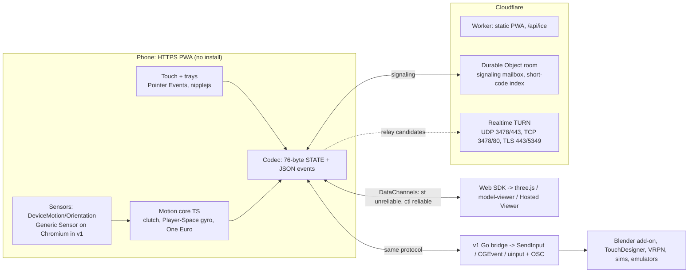

# ob-pal: phone as a 3D remote (plan, 2026-09-25)

> **Status (2026-09-25):** decided: solo build, web-3D-first launch, MIT license (matching Blackboxes). The MVP vertical slice is live at https://obpal.blackboxes.net: pairing, the Rotate and Point modes, the trackpad, trays, and the hosted viewer. Still to do before relay coverage: a TURN key. The wire protocol is written up in [spec/PROTOCOL.md](spec/PROTOCOL.md).
>
> **2026-09-26:** the controller is an offline-capable PWA (service worker, versioned cache), and a phone that paired once with ob.Pal Link reconnects over the LAN through a **direct code** with no server involved (PROTOCOL.md §2a). Connecting is front-loaded: the phone's offer is built while signaling connects, the extension keeps its link warm from browser start, and both sides give the service 1.5 s before switching to the direct path.

> Vision: scan once and the phone becomes a remote for 3D objects and on-screen navigation. It works through the gyroscope, swipe/trackpad gestures and button trays, on as many phone, OS and screen combinations as possible, and is built from existing tech.

## TL;DR: the easiest path with the widest reach

1. **Phone = a web app (PWA) on one public HTTPS origin, opened by scanning a QR code.** Nothing to install.
   - Full support: iOS/iPadOS 16.4+ and Android 10+. That is about 98% of active phones.
   - Best-effort: iOS 15 and Android 7–9.
2. **Link = WebRTC DataChannel.** An unreliable channel carries motion at 60 Hz, and a reliable channel carries buttons.
   - Signaling goes through a Cloudflare Worker + Durable Object.
   - Cloudflare TURN (UDP/TCP/TLS 443) is always configured. Sessions therefore work on home Wi-Fi, guest Wi-Fi with client isolation, cellular and UDP-blocked networks.
3. **Why not a LAN web server:**
   - Motion sensors need HTTPS (WebKit and Chromium).
   - An HTTPS page can't open `ws://` to a LAN IP in Safari, and Chrome 147+ puts a permission prompt in front of it.
   - WebRTC is the one prompt-free path from a public page to a LAN host today.
4. **Hosts, three tiers, one protocol:**
   - (a) **JS SDK** for browser 3D apps (three.js, model-viewer, Babylon). Zero install. Also covers ChromeOS, Quest, Vision Pro and modern TVs.
   - (b) **Small native bridge** (Go + pion) for desktop apps. It injects OS mouse/keyboard input and sends OSC to a Blender add-on for exact 1:1 rotation.
   - (c) **Later:** legacy protocol emitters (VRPN, opentrack, DSU, TUIO, MIDI), virtual HID devices, and an Android-only Bluetooth-HID "Direct mode".
5. **Input:**
   - Clutched gyro: hold a pad to rotate the object, or use the phone as an air pointer.
   - Trackpad gestures: orbit, pan, pinch-zoom, twist.
   - Button trays defined in JSON.
6. **We reuse:**
   - browser WebRTC and WebCrypto, Cloudflare DO/TURN, pion
   - GamepadMotionHelpers "Player Space" gyro math, One Euro filter
   - nipplejs, camera-controls, uqr
7. **MVP is web-only: about 5 weeks for 2 engineers, about 7 solo.** The native bridge is v1.

---

## 1. Goals & MVP targets

| Metric | Target |
|---|---|
| First scan → object moving (includes the iOS motion prompt) | ≤10 s median |
| Resume after a 30 s screen lock | ≤3 s p90 |
| Sessions reaching control on home, AP-isolated, cellular and UDP-blocked networks | ≥97% |
| Phone glass → host receive, LAN (in-band telemetry) | ≤35 ms p95 |
| Motion-to-photon, LAN, 60 Hz display | ≤65 ms p50 |
| Motion-to-photon, relayed via TURN | ≤110 ms p50 |
| Drift, clutch held 60 s | <1.5° |
| Unauthenticated input accepted | 0 |

## 2. Architecture



**Principles:**
- The phone never knows which kind of host it is talking to.
- Adding a host type never changes the phone.
- Motion is interpreted once, on the phone, in one TypeScript module. Deploying the PWA updates tuning for every phone.
- Hosts only interpolate to their frame rate.

## 3. Reuse vs build

| Need | Reused | We build |
|---|---|---|
| Transport, NAT traversal, encryption | Browser WebRTC (ICE/DTLS/SCTP), pion (bridge), Cloudflare TURN | Link state machine, reconnect |
| Signaling | Durable Objects with WebSocket Hibernation | ~150 LOC room logic |
| Sensor fusion | OS fusion behind the W3C APIs | Normalization, quaternion + screen-angle compensation |
| Gyro feel | GamepadMotionHelpers (MIT, algorithm), One Euro filter (BSD-3) | TS port, mode mappers |
| Touch UI | Pointer Events, nipplejs (MIT) | Gesture recognizer, tray renderer |
| QR | Phone camera app, uqr (MIT) | – |
| 3D control | three.js, camera-controls (MIT), model-viewer | Adapters |
| OS input (v1) | SendInput, CGEventPost, uinput/libei | Thin injectors, per-app profiles |
| Legacy ecosystems (v1+) | OSC, VRPN JsonNet, opentrack, DSU, TUIO, MIDI specs | Emitters (20–150 LOC each) |

**Not used, and why:**

| Excluded | Why |
|---|---|
| Plain-HTTP LAN pages (the HappyFunTimes approach) | No sensors |
| `https→ws://LAN` | Blocked in Safari, prompted in Chrome |
| Plex-style LAN certificates | DNS-rebind breakage |
| ViGEmBus | Archived 2023-11-02 |
| libdatachannel for the bridge | Cannot do TURN over TLS |
| hammer.js, gyronorm, Full Tilt, the original simple-peer | Dead |
| AirConsole, KDE Connect and Unified Remote protocols | Closed, GPL, or native on both ends |

## 4. Pairing & connection

**QR pairing (primary):**
1. **Host shows a QR code.** The host is the SDK page or Hosted Viewer (the bridge from v1).
   - QR content: `https://<origin>/p#<S>.<fpH>`.
   - `S` is 128 random bits and `fpH` is the host's DTLS certificate fingerprint. Both sit in the URL fragment, which never reaches a server.
   - Room id = `H(S)`.
2. **Phone scans with its Camera app**, which opens the default browser.
   - The PWA strips the fragment from the URL.
   - It warms up signaling, TURN credentials and ICE before the user taps anything.
   - It detects in-app browsers (Instagram, Facebook and similar) and offers "Open in Safari/Chrome". Touch-only mode is always available.
3. **Motion permission:**
   - On load, try `requestPermission()` without a gesture. iOS remembers a grant per origin until the browser is closed.
   - If a prompt is needed, show **one "Tap to start" button**. In a single click handler:
     1. Call `DeviceMotionEvent.requestPermission()` and `DeviceOrientationEvent.requestPermission()` synchronously, without awaiting, on **every** engine that has them: iOS 13+ and Chrome/Edge/WebView 152+.
     2. Call `navigator.wakeLock.request('screen')`. Use NoSleep.js as the fallback on iOS 15 and on Home Screen apps below 18.4.
     3. On Android only, call `requestFullscreen()` last, because fullscreen consumes the user activation. Then lock the orientation.
4. **DataChannel opens:**
   - The phone checks that the answer's DTLS fingerprint equals `fpH`.
   - The phone sends `HMAC(HKDF(S), fpP‖fpH‖roomId)` on `ctl`.
   - The host accepts **no input until that verifies**.
   - This alone defeats a malicious signaling server, TURN operator or network MITM. No custom encryption layer is needed.
5. **Sensor tier classification** (about 500 ms) decides which modes are enabled. The host then pushes its layout.

**Other paths:**
- **Short code (MVP, for Quest/Vision Pro/TVs and installed iOS PWAs):**
  - The user types a 6-digit code into the PWA. The code is rate-limited in the DO.
  - Host and phone run a commit-then-reveal ECDH.
  - Both screens show a 4-emoji code to compare, and the host user clicks "Allow <device>?". **A code alone never grants control.**
  - Installed iOS Home Screen apps need this path: they don't share Safari's storage, and Camera scans always open the browser.
- **Remembered host, direct code (shipped with ob.Pal Link, 2026-09-26):**
  - After an online pairing the host hands the phone a pairing id and key inside the DTLS channel; both keep their own certificate (IndexedDB) and the other's fingerprint.
  - With the service unreachable the host shows a direct code: its live ICE credentials and host candidates plus a nonce. The phone answers with credentials derived from the key and the nonce, the host learns the phone's address from its connectivity checks (peer-reflexive), and DTLS pins both remembered fingerprints. No server, and nothing for a phone that never paired.
  - Safari's 7-day storage cap means a rescan (online) is sometimes still needed. That is expected.
- **Resume over the room service (v1):** the same pairing key could let a returning phone rejoin without a rescan when the service is up.
- **After screen lock:** on `visibilitychange`:
  - if the connection is still up, resume;
  - if it is `disconnected`, run `restartIce()` over the always-connected host DO socket;
  - if it has `failed`, rebuild it.

**Prompts per platform:**
- **iOS:** the motion prompt (per browser session).
- **Android:** none today. Chrome plans an "ask" default, and the Start gate already handles it.
- **macOS host running Chrome, Edge or Firefox:** a one-time Local Network alert on the first LAN WebRTC connection. If it is denied, the session uses TURN.
- **Bridge (v1):** macOS Accessibility and Local Network; Windows firewall rule at install.

## 5. Input model

- **Clutch everything.** Gyro motion applies only while a thumb is on the Grab/Aim pad. This removes web yaw drift, makes any grip comfortable, and allows ratcheting.
- **Quaternions only** on the wire (no Euler angles). No magnetometer.

**MVP modes:**

| Mode | Behavior |
|---|---|
| **Hold** | On clutch-down, store `q0`. Send `qRel = q0⁻¹·q`, mapped into the view frame. The host rotates the object 1:1, with an optional 1.5–2.5× amplify. Double-tap resets. |
| **Air pointer** | Player-Space yaw/pitch integrated into accumulators, so a lost packet costs nothing. Sensitivity curve, and tightening at slow speed. Tap = click. |
| **Trackpad** (default centre area) | 1-finger drag = orbit, 2-finger = pan, pinch = dolly, twist = roll, double-tap = frame, flick = inertia. nipplejs joystick for fly/walk. |

**v1 modes:** gyro Orbit (camera) and Tilt-to-navigate (deadzone plus expo curve). Tilt is the main mode on phones without a gyro.

**Sensor tiers:**
- MVP: **gyro**, or **touch-only** if permission is denied or there are no events.
- v1: **compass** and **tilt-only** tiers, for gyro-less budget Android phones.

**Trays:**
- **Layout:** a JSON layout with regions `main`, `dock`, `rail` and `chips`. Controls: `button`, `clutch`, `toggle`, `segmented`, `slider`, `dpad`, `joystick`, `trackpad`.
- **Where layouts come from:** built-in presets (Orbit & Inspect, Air Pointer/Presenter, Fly/Walk, CAD), or pushed by the host.
- **Actions:** the phone sends **action IDs only**. The host (SDK or bridge profile) decides what each ID does.
- **Handedness and orientation:** the MVP has a left/right handedness toggle. Landscape variants come in v1.

**Filtering:**
- One Euro filter on capture timestamps, with two user sliders: Smoothness and Responsiveness.
- Recenter button.
- Stillness auto-calibration comes in v1.

**Feedback:**
- `vibrate()` on Android Chromium.
- The iOS 18+ `<input switch>` haptic on direct taps.
- A visual press state everywhere.

## 6. Wire protocol

- **Channels:** two pre-negotiated channels on one peer connection.
  - `ctl` (id 0): reliable, JSON.
  - `st` (id 1): `{ordered:false, maxRetransmits:0}`. Always set both options.
- **STATE (76 bytes, little-endian, one per sensor sample, about 60 Hz):**

| Field | Contents |
|---|---|
| Header | version/type byte, flags, u16 seq, u32 capture time (µs) |
| Mode | mode, grab id, tier/screen angle, touch count |
| Orientation | qAbs and qRel as i16×4 (Q15) |
| Motion | gyro as i16×3 (mrad/s); gravity as i16×3 |
| Accumulators | aim accumulators as i32×2 (milli-degrees); 1-finger and 2-finger pad accumulators as i32×2 each; zoom and twist as i16 |
| Sticks | joystick and tilt stick as i8×2 each |
| Buttons | u32 held-button bitmask |

  - Accumulators are never deltas, so lost or reordered packets are harmless. The receiver keeps only the newest seq.
- **Rates:**
  - 60 Hz while active, 15 Hz when idle, 0 Hz while hidden.
  - Skip a send if `bufferedAmount` is building up.
  - Wire cost is about 170 B per packet, roughly 10 KB/s or ~36 MB/h. Negligible even when relayed.
- **Events on `ctl`:**
  - Phone → host: `hello{caps}`, `bind{mac}`, `btn{id,ev}`, `value{id,v}`, `mode`, `recenter`, `ping`.
  - Host → phone: `layout`, `state`, `feedback{haptic,toast}`, `warn`, `pong`.
  - Button edges on `ctl` are authoritative. The bitmask in STATE is the backstop against stuck keys.
- **Heartbeat:**
  - 1 Hz ping/pong (RTT and link badge).
  - After 250 ms without STATE, the host freezes smoothly.
  - After 3 s of silence, restart ICE.
- **Host timing:**
  - MVP (TypeScript only): render at "now minus one sensor period", slerp/lerp between the two bracketing samples, and hold the last pose on underrun.
  - v1: adaptive jitter buffer and bounded dead-reckoning.

## 7. Host integration

**(a) Web SDK (MVP, zero install)**

```js
import { Remote } from '@obpal/host'; import { threeObject, cameraControls } from '@obpal/host/adapters';
const r = await Remote.create({ appName: 'Part Viewer', layout: 'orbit-inspect' });
r.mountPairing(el);                 // QR + short code + status
threeObject(r, mesh, { camera });   // Hold -> quaternion
cameraControls(r, controls);        // trackpad orbit/pan/dolly
r.on('button', e => ...); r.sample(frameTime); r.setLayout(json);
```

- **Hosted Viewer:** a static page. Drag in GLB/glTF/STL/OBJ/PLY; files stay local. Kiosk mode.
- **Where it runs:** every desktop browser, ChromeOS, iPad, Quest Browser, Vision Pro Safari, Tizen 2025+ and Raspberry Pi kiosks.
- **v1 additions:** Babylon and A-Frame adapters, a Gamepad API shim (Unity WebGL, Godot, PlayCanvas), and a WSS-relay build for TVs without WebRTC.

**(b) Native bridge (v1: Windows first, then macOS, then Linux)**

**Stack:**
- Go + pion/webrtc v4 as a single binary. pion does TURN over TLS 443 and advertises raw LAN IPs, which avoids the browser mDNS failure mode.
- Tray, keyring and signed installers.
- Hand-written key tables instead of robotgo, to avoid a cgo toolchain.

**OS injection:**
- **Windows:** `SendInput` absolute + VIRTUALDESK, which avoids pointer acceleration. Plus a relative path. It detects and warns when UIPI blocks input to an elevated window.
- **macOS:** `CGEventPost`, posting `*MouseDragged` events with delta fields. Needs Accessibility permission. Notarized Developer ID build.
- **Linux:** uinput with a udev rule, which works on X11 and Wayland. libei portal as the fallback.

**Per-app profiles** (they map action IDs to input):
- Blender: MMB orbit
- Fusion 360: Shift+MMB orbit
- SketchUp: MMB orbit
- Onshape: right-drag orbit
- Presenter keys

**OSC** on localhost, plus a **Blender add-on** (a separate GPL program that speaks OSC; vendors python-osc). Gives true 1:1 viewport/object rotation on every OS. TouchDesigner and Unity/Unreal OSC plugins work too.

**Safety:**
- Injection is off until enabled per phone.
- The tray shows a "controlled by <device>" state.
- Panic hotkey.
- No listening TCP service.

**Alternative stack:** Electron, reusing the TS SDK verbatim, gives one language but a larger installer. Confirm the choice at v1 kickoff.

**v1 kickoff decisions (2026-09-26):**
- **Rust instead of Go.**
  - The toolchain is already on the dev machine, and the owner's other projects use it.
  - It's memory-safe for a process that injects input.
  - The `windows` crate gives SendInput without cgo.
  - It builds a single static binary.
- **Reached through the browser extension**, via Chrome Native Messaging over stdio.
  - The extension already holds the phone link.
  - The helper has no network listener at all, which is stricter than "emitters bind to loopback".
  - Control is enabled and scoped **per program** in the browser: an allowlist of programs, each with allowed input kinds. The helper enforces it against the foreground process.
- **Control catalogue** (spec/CATALOGUE.md): every control is a catalogue utility, and hosts map utilities to outputs through profiles.

**(c) Later, on demand**
- **Legacy protocols:**
  - VRPN via its stock `vrpn_Tracker_JsonNet` (sci-vis, CAVEs)
  - opentrack UDP 4242, 48 B `double[6]` (flight sims)
  - DSU/cemuhook UDP 26760, protocol 1001 (Dolphin, Cemu)
  - TUIO 3333
  - MIDI
- **Virtual HID devices:**
  - Windows: HIDMaestro, MIT, user-mode UMDF2; pin ≥1.9.0.
  - Linux: uinput 6-axis device picked up by spacenavd, which drives Blender and FreeCAD.
  - macOS: only if Apple grants the virtual-HID entitlement.
  - Only our own IDs unless legal signs off.
- **Android Direct mode:**
  - `BluetoothHidDevice` composite: mouse, keyboard and consumer keys, a multi-axis controller, and a vendor collection.
  - Controls TVs and locked-down PCs with no host software at all.
  - Some OEMs disable it, so probe at runtime by behavior.
  - iOS can never do this.

## 8. Compatibility

| Phone | Host | Network | Path | Status |
|---|---|---|---|---|
| iPhone iOS 16.4–27, any iOS browser | Windows/macOS/Linux browser page | Home Wi-Fi | LAN P2P (TURN if mDNS filtered) | Yes |
| Android 10+ Chrome / Samsung / Edge | Any browser page | Home | LAN P2P | Yes |
| Firefox Android | Any | Home | P2P / TURN | Yes (no haptics) |
| iOS Chrome/Edge/Firefox (WKWebView) | Any | Home | P2P. Apple documents an exemption from the Local Network prompt, but real-world reports are mixed, so test on device. | Yes, TURN if blocked |
| iOS/Android in-app browsers | Any | Any | "Open in browser" card, or touch-only | Partial |
| Android 17 WebView in-app (host app targets SDK 37) | Any | Home | LAN blocked → TURN | Partial (+latency) |
| Gyro-less budget Android | Any | Any | Touch-only (MVP), tilt (v1) | Partial |
| iPhone iOS 15.x / Android 7–9 | Any | Any | P2P + NoSleep fallback | Best-effort |
| Any | Any | Guest Wi-Fi / AP isolation / eduroam | TURN UDP | Yes (+10–40 ms) |
| Any | Any | Phone on cellular | STUN, else TURN | Yes |
| Any | Corporate laptop, UDP blocked | Corp | TURN TLS 443 | Partial (TCP judder) |
| Any | macOS Chrome host, Local Network denied | Home | TURN | Yes (+latency) |
| Any | Quest / Vision Pro browser | Home | Short code → P2P | Yes |
| Any | Tizen 2025+ TV | Home | P2P | Yes |
| Any | Older Tizen/webOS, no WebRTC | Home | WSS relay build (v1) | v1 |
| Any | Blender/CAD on Win/mac/Linux | Home | Bridge (v1) | v1 |
| Any | Google TV / locked-down PC | – | Android Direct mode (v2) | v2, Android only |
| Any | Air-gapped LAN | – | Offline WebTransport mode (v2) | No until v2 |
| Any | Mainland China | – | No Cloudflare TURN there | Out of scope |

**Fallback ladders:**
- **Transport:** LAN host → STUN → TURN UDP (3478/443) → TURN TCP → TURN TLS 443. In v1, a WSS relay through the DO is added as the last resort. The phone offers with host + STUN candidates at once and waits at most 250 ms for TURN credentials; a failed attempt rebuilds with TURN.
- **Signaling:** room service (1.5 s to answer) → direct code over the LAN for a remembered phone (host candidates only: same network, multicast DNS) → later, the native helper as a LAN endpoint that needs no SDP changes on the phone (ICE-lite, credentials read from the STUN USERNAME).
- **Sensors:** events → touch-only in the MVP. In v1: Generic Sensor → events → compass/tilt → touch.
- **Pairing:** camera QR (online) → direct code (remembered host, no service) → short code + approval (later).
- **Controller page:** network → service worker cache (after one visit; installs as an app).
- **Keep-awake:** Wake Lock → NoSleep.js → fast resume.

## 9. Security (minimal, correct)

- **Threat model:** remote-input tools have a history of RCE (Unified Remote EDB-49587, Remote Mouse CVE-2021-27569..27574). The signaling server, TURN and the network are untrusted.
- **The secret:** `S` lives only in the QR fragment and is stripped at once. Pairing secrets expire in 5 minutes.
- **Authentication:** DTLS fingerprint pinned from the QR, plus the HMAC channel binding. No input is accepted before binding.
- **Short code:** commit-reveal ECDH, emoji comparison, and host approval. Rate-limited in the DO, not via the per-location Rate Limiting binding.
- **Session rules:** single-controller lock; takeover needs host approval.
- **TURN abuse controls:** TURN credentials are short-lived and issued only to joined room members. The SDK uses site keys bound to allowed Origins. Per-IP and per-room quotas, and an alarm on TURN egress.
- **Bridge:** executes only host-side profile actions, never raw key sequences from the phone. Signed installers and updates. Emitters bind to loopback. Fuzz the codec and DO before v1.
- **Privacy:** no accounts, no input stored server-side, and model files never leave the host.

## 10. Roadmap

**Week 0 (prerequisites):**
- Fix the product name and **production domain**. It is baked into QR codes, the PWA origin and stored keys.
- Cloudflare account; monorepo scaffold and CI.
- Dev loop (§11).
- Device lab:
  - iPhones: iOS 15.8 (SE1), iOS 16.x, iOS 18, current iPhone, iPad
  - Android: Pixel, Galaxy A with Samsung Internet, a gyro-less budget phone, Android 9
- Start Apple Developer enrollment and Azure Artifact Signing now, because they take time and v1 needs them.

**MVP (web-only, weeks 1–5 for 2 engineers; about 7 solo):**

| Week | Work |
|---|---|
| 1 | Vertical slice on the real stack: DO signaling, DataChannel, deviceorientation → a rotating three.js cube, on real phones via the dev origin |
| 2 | QR pairing (S + fpH + HMAC binding), `/api/ice` TURN credentials, reconnect on visibilitychange |
| 3 | Controller PWA: permission/Start gate, gyro and touch tiers, Hold + Air pointer, trackpad, tray presets, handedness |
| 4 | SDK (`sample()`, three.js / camera-controls / model-viewer adapters, pairing widget) + Hosted Viewer |
| 5 | Short code + approval, telemetry (glass-to-receive, path, tier), matrix QA on 4 network types, netem loss/jitter smoke test, beta |

**MVP exit:** the §1 targets are met on the device lab across home, AP-isolated, cellular and UDP-blocked networks.

**v1 (about weeks 6–14):**
- Go bridge on Windows, then macOS, then Linux, with per-app profiles and OSC + Blender add-on (1:1).
- Resume without rescan; WSS relay fallback and TV build.
- Orbit and Tilt modes; compass/tilt tiers; Generic Sensor timestamps; stillness calibration.
- Adaptive playout; layout editor; landscape presets.
- Babylon and A-Frame adapters, Gamepad shim.
- VRPN JsonNet emitter if sci-vis is a target.
- External pen test.

**v2 (each item only on demand or telemetry):**
- opentrack / DSU / TUIO / MIDI emitters.
- Virtual HID (HIDMaestro, spacenavd).
- Android Direct mode.
- Native shell, one Expo app with a Kotlin module, **only** if it wins more than 10 ms or iOS haptics are required.
- Offline WebTransport LAN mode (Safari 26.4+); multi-controller rooms.

## 11. Dev loop & repo layout

- **Dev loop:**
  - Phones need HTTPS to get sensors. Run Vite + Worker/DO locally with `@cloudflare/vite-plugin` or `wrangler dev`.
  - Expose it through a **named Cloudflare Tunnel on a fixed dev hostname**. Phones then scan real QR codes, and stored keys survive restarts.
  - Check first which ports are free; see the port list in the global CLAUDE.md.
- **Repo:** a pnpm-workspace monorepo.

```
apps/controller     phone PWA (Vite + Preact, build targets safari15/chrome95/firefox115)
apps/viewer         Hosted Viewer
worker/             Worker + Durable Object (serves /p, /view, /api, /r)
packages/protocol   codec, HMAC binding, golden test vectors (shared with Go bridge)
packages/host       web SDK + adapters
bridge/             Go + pion (v1)
addons/blender      OSC add-on (v1)
```

- **Versioning:** the PWA supports protocol N and N-1, gates features on `caps`, and ignores unknown fields. Hosts can therefore lag behind a centrally deployed PWA.

## 12. Risks

| Risk | Mitigation |
|---|---|
| Chrome ships Local Network Access gating for WebRTC (still "Proposed") | TURN is always in the ICE config; alarm on relay-share jumps; bridge raw-IP path; WebTransport in reserve |
| Chrome switches motion permission to "ask" | requestPermission is already called on every engine; capability detection, not UA sniffing |
| iOS permission friction (per-session prompt, sticky denial, in-app browsers) | Silent re-check on load, escape card, touch-only always works, short code for installed PWAs |
| Browser↔browser P2P fails more than expected | Budget 15–30% relayed (AirConsole saw ~14% of routers fail P2P); TURN cost negligible |
| 60 Hz web sensor ceiling | Enough for orbit, rotate and point. Native shell gated on measured benefit |
| Bridge OS friction (SmartScreen, macOS TCC, UIPI, Wayland) | Stable signing identity, guided permission wizard, UIPI warning, libei fallback |
| Cloudflare dependency | Established P2P sessions survive a signaling outage; a remembered phone reconnects through the direct code with no service at all; the room is small and re-hostable; coturn documented |
| Chrome removes ICE-credential SDP munging (`WebRTC-NoSdpMangleUfrag`, announced, date unset) | Only the phone side of the direct code depends on it and it detects the rejection (`InvalidModificationError`) and falls back to the online path; iOS Safari unaffected; the native helper takes over as an ICE-lite LAN endpoint that needs no munging |
| Battery and thermals | Gate at ≤10% battery per hour on the oldest full-tier iPhone; dark UI; 15 Hz idle |

## 13. Open decisions (owner)

1. **Launch focus.** Web 3D viewers (recommended), desktop DCC/CAD (pulls the bridge into the MVP), or presenter/TV.
2. **Team size.** 2 engineers means about 5 weeks for the MVP; solo means about 7.
3. **Cloud-dependent pairing.** Recommended: accept it for the first pairing. Done: a remembered phone reconnects over the LAN with no service (direct code); a first pairing still needs the service.
4. **Licensing.** Recommended: open-source the protocol and SDK at minimum.
5. **Name and domain.** Must be fixed before beta.
6. **Bridge stack.** Go + pion (recommended; its TURN-over-TLS support was checked) or Electron reusing the TS SDK.
7. **Telemetry default.** Recommended: anonymous, no input data, on with opt-out, because the v1/v2 gates depend on it.

## 14. Verified facts (checked 2026-09-25) and corrections applied

- **Motion sensors need a secure context** in WebKit (every iOS browser) and Chromium. Firefox doesn't enforce this, which doesn't matter because we are HTTPS.
- **`requestPermission()` in Chromium shipped in Chrome 152, not 151.** It grants by default today, and an "ask" default is planned. Its presence no longer means iOS.
- **iOS keeps the motion grant per origin for the browsing session.** Hence the silent re-check on load.
- **Fullscreen and permission order:** `requestFullscreen()` consumes user activation; `requestPermission()` does not. So call the permission requests synchronously first, then fullscreen.
- **Chrome Local Network Access:** prompts for fetch from M142 and for WebSocket/WebTransport from M147. WebRTC gating is still "Proposed".
- **Apple TN3179:** exempts Safari, SFSafariViewController and WKWebView from the Local Network permission (iOS 14+, macOS 15+). Real-world results for WKWebView browsers are disputed, so device testing is required.
- **macOS 15+ Local Network permission:** required for Chrome, Edge, Firefox and bridge app bundles.
- **Android 17 `ACCESS_LOCAL_NETWORK`:** affects WebView in-app browsers whose host app targets SDK 37.
- **mDNS host candidates:** browsers hide LAN IPs behind `.local` names when the page has no camera/mic grant, which fails where multicast is filtered. The pion bridge advertises raw IPs and learns peer-reflexive candidates.
- **TURN over TLS:** pion supports TURN over TCP/TLS. libdatachannel's ICE backends (libjuice, libnice) don't provide TURN-TLS.
- **Cloudflare TURN:**
  - Ports: UDP 3478 and 443, TCP 3478 and 80, TLS 5349 and 443.
  - Pricing: $0.05/GB after 1,000 GB/month free; only egress to the client is billed.
  - Filter restricted ports such as 53.
- **Durable Object hibernation:** only while nothing is pending, so use alarms, not timers. Use autoResponse for pings. Deploys drop sockets, so clients reconnect with jitter.
- **Unreliable channel options:** `ordered:false` plus `maxRetransmits:0` works on iOS Safari 11+, Chrome 31+ and Firefox 62+. Always set both.
- **ViGEmBus** was archived 2023-11-02. **HIDMaestro** (MIT, UMDF2) is the user-mode replacement; pin ≥1.9.0.
- **Android `BluetoothHidDevice`:** vendor-gated and off on some OEMs. Probe by behavior; the sysprop is unreadable. iOS rejects the HID service UUID.
- **Legacy protocol specs:** opentrack UDP 4242 is 48 B of 6 little-endian doubles. DSU is UDP 26760, protocol 1001, CRC32.

## Sources

- W3C DeviceOrientation: https://w3c.github.io/deviceorientation/
- MDN `requestPermission`: https://developer.mozilla.org/en-US/docs/Web/API/DeviceOrientationEvent/requestPermission_static
- Chrome LNA: https://developer.chrome.com/blog/local-network-access
  - chromestatus WebSocket: https://chromestatus.com/feature/5197681148428288
  - chromestatus WebRTC: https://chromestatus.com/feature/5065884686876672
- Safari 26.4: https://webkit.org/blog/17862/webkit-features-for-safari-26-4/
- Safari 18.4 notes: https://developer.apple.com/documentation/safari-release-notes/safari-18_4-release-notes
- Apple TN3179: https://developer.apple.com/documentation/technotes/tn3179-understanding-local-network-privacy
- Android local network permission: https://developer.android.com/privacy-and-security/local-network-permission
- Cloudflare TURN: https://developers.cloudflare.com/realtime/turn/
  - pricing: https://developers.cloudflare.com/realtime/pricing/
- Durable Objects WebSockets: https://developers.cloudflare.com/durable-objects/best-practices/websockets/
- pion: https://github.com/pion/webrtc
- libjuice: https://github.com/paullouisageneau/libjuice
- GamepadMotionHelpers: https://github.com/JibbSmart/GamepadMotionHelpers
- Player Space gyro: http://gyrowiki.jibbsmart.com/blog:player-space-gyro-and-alternatives-explained
- One Euro filter: https://gery.casiez.net/1euro/
- nipplejs: https://github.com/yoannmoinet/nipplejs
- camera-controls: https://github.com/yomotsu/camera-controls
- ios-haptics: https://github.com/tijnjh/ios-haptics
- iOS PWA notes: https://firt.dev/notes/pwa-ios/
- SendInput: https://learn.microsoft.com/en-us/windows/win32/api/winuser/nf-winuser-sendinput
- uinput: https://www.kernel.org/doc/html/latest/input/uinput.html
- RemoteDesktop portal: https://flatpak.github.io/xdg-desktop-portal/docs/doc-org.freedesktop.portal.RemoteDesktop.html
- ViGEmBus: https://github.com/nefarius/ViGEmBus
- HIDMaestro: https://github.com/hifihedgehog/HIDMaestro
- spacenavd: https://github.com/FreeSpacenav/spacenavd
- opentrack UDP: https://github.com/opentrack/opentrack/blob/master/tracker-udp/ftnoir_tracker_udp.cpp
- DSU protocol: https://v1993.github.io/cemuhook-protocol/
- Android `BluetoothHidDevice`: https://developer.android.com/reference/android/bluetooth/BluetoothHidDevice
- HappyFunTimes (deprecated): https://github.com/greggman/HappyFunTimes
- Unified Remote RCE: https://www.exploit-db.com/exploits/49587
- Remote Mouse CVEs: https://www.cvedetails.com/vulnerability-list/vendor_id-24559/Remotemouse.html
