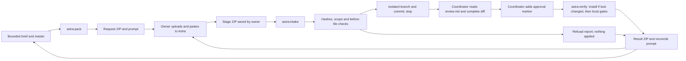

# The Astra exchange

Use Astra in ChatGPT for one bounded engineering stage at a time. Transport is manual: upload a request ZIP,
paste its prompt, save Astra's returned ZIP, and let the local integrator verify and apply it. The coordinator owns merging
and deployment. No exchange command merges, pushes, deploys, publishes, installs Desktop or accesses the registry.



## 1. Write the brief

Use a Markdown file with `## Acceptance` and `## Out of scope` headings. Name the exact behavior, allowed files,
acceptance checks and next stage. Keep private details out. An optional `Worker version: ...` line records the live
version supplied in the brief; the tool does not contact production or verify that claim independently.

```markdown
# Sample: add a unit test for invalid code handles

Add one test to tests/code.test.ts for invalid code-handle input. Preserve runtime behavior.

## Acceptance
- The new case exercises a previously uncovered input.
- pnpm run check passes.

## Out of scope
- Runtime changes, dependencies, UI, Desktop and browser flows.
```

## 2. Build the request

From the coordinator's checkout, after verifying master:
In PowerShell, use `pnpm.cmd` with the same arguments if execution policy blocks the `pnpm.ps1` wrapper.

```powershell
pnpm run astra:pack -- --stage sample-code --task artifacts/astra/TASK.md --paths "packages/core/src/code.ts,tests/code.test.ts" --budget 1
```

Default outbox: your Windows home folder's `Downloads/obpal-astra/outbox`. Override it with `--outbox <folder>`.
The files are `obpal-<stage>-Request-<UTC>.zip` and `obpal-<stage>-Request-<UTC>.prompt.txt`. Stage ids use lower-case
letters, digits and hyphens, up to 60 characters. Keep the original ZIP unchanged: intake uses it as its trusted scope
and provenance. Request archives are not cryptographic signatures; the owner must retain a trusted original.

`--paths` accepts comma-separated portable globs: `*` within a path component, `**` across directories, and `?` for one
character. Omit it for all eligible tracked files. Source comes from the pinned **master Git blobs**, including when
the calling worktree has uncommitted changes. It does not export the calling branch's pending implementation.
Use `--at <sha>` to pin an earlier master commit explicitly even if master moves; it must be an ancestor of master.
`source_modes` records each exported file's Git mode; preserve it when constructing diffs from the snapshot.

### Full and lean packs

`--mirror <public-commit-sha>` records the public snapshot at `https://github.com/Axialon/obpal` in MANIFEST's
`repository_mirror: { url, commit, equals_private, sanitized_paths: ['wrangler.jsonc'] }` and START_HERE.
`equals_private` is the full pinned private master SHA. Each public publish is one snapshot commit with the same
tracked content as private master, except the deployment placeholders made by `scripts/open-source.mjs` SANITIZE.
Verify this equality over the export scope before sending a pack. Public history is snapshot history; private
development history is not published. Astra should browse, search and read source and docs at the named public commit.

The default full-source pack includes `source/`. Add `--lean` to include only START_HERE, TASK, RETURN_CONTRACT,
ASTRA_PROMPT and MANIFEST. Lean requires `--mirror`. Its manifest retains the **full source_hashes and source_modes
of the eligible export scope**, without size-budget trimming of hashes. If the docs and complete manifest exceed the
ZIP budget, packing refuses; narrow the scope or raise the budget. Source is still scanned before omission.
Astra reconstructs before bytes from the mirror commit and verifies SHA-256 against MANIFEST.source_hashes.
GitHub failure or a hash mismatch means a one-line explanation and request for the full-source pack, never a guessed
delta. Sanitized wrangler.jsonc bytes cannot replace private before bytes if that path is selected. Intake uses the
same scope, archive digest and before-hash checks for either pack; no source/ members are needed for lean intake.

```powershell
pnpm run astra:pack -- --stage sample-code --task artifacts/astra/TASK.md --paths "packages/core/src/code.ts,tests/code.test.ts" --at <private-master-sha> --mirror <public-commit-sha> --lean --messages 14 --spent 0
```

Every selected eligible source file and the brief pass `scripts/lib/scan.mjs` before size trimming. The deny list is
read from this checkout and, for a linked worktree, the main checkout; its words are never printed. Binary members
are scanned too. Private findings refuse the request. The tool does not silently sanitize deployment ids: a whole-repo
request may be refused, in which case select a public, bounded scope. Local-only and guarded paths are excluded.

The budget is in MiB (default 24, maximum 64), covering both compressed ZIP size and all expanded member bytes,
including the manifest. In full packs, largest source files are trimmed first; every omission and reason appears in the manifest and
console report. Fixed instructions are never trimmed. A request with no remaining source is refused. Do not ask Astra
to modify a trimmed path. Narrow the scope or increase the budget when the stage needs that context.

Optionally pass `--checkpoint <json>` with `master_sha`, `check_summary` and `e2e_summary` from the coordinator's last
real verification. A mismatching master is refused. Without those records, START_HERE says the checks are not recorded;
it never invents a green checkpoint. Checkpoint text and the brief are scanned before export.

### Working within the message budget

Astra has 200 messages for the whole programme. `--messages <n>` allocates this stage's budget (default 12);
`--spent <n>` optionally supplies the programme total used so far. These are message counts, separate from the
`--budget` ZIP size in MiB. MANIFEST records `message_budget: { programme_total: 200, stage, spent }`, with null
when spent was not supplied. START_HERE and the one-paste prompt carry the same line. Counts must be whole numbers;
stage messages are 1–200 and supplied spent plus stage allocation must fit 200.

Keep a local budget ledger: stage, allocation, spent before, actual Astra replies used, spent after and messages
remaining. Update actual usage after each reply and pass that total as `--spent` for the next request. Return ZIP
ASTRA_START carries the original request's budget checkpoint; it does not invent later usage. A dense, one-paste
reconcile costs Astra one message per round trip. One message delivers a coherent stage ZIP or precise reconcile.
Astra plans internally, resolves questions from the pack/GitHub, records assumptions in STAGE.md, self-checks with
code where available and reports actual execution. If work cannot fit, one message includes a coherent partial
and a precise continuation plan.

The compact prompt uses a clear role, goal, reading order, constraints and output contract, following
[OpenAI's reasoning prompting guidance](https://developers.openai.com/api/docs/guides/reasoning-best-practices#how-to-prompt-reasoning-models-effectively).
Detailed product and exchange rules stay in START_HERE.

## 3. Upload and paste

Attach the request ZIP in your Astra conversation in ChatGPT. Paste the entire sibling `.prompt.txt` once. START_HERE,
TASK, MANIFEST and RETURN_CONTRACT provide context, bounds, exact source hashes and the required return format.
Ask Astra to return the ZIP as a downloadable file, then save it to `Downloads/obpal-astra/inbox`.
Lean packs use the public GitHub snapshot for source; keep the original request ZIP for intake.

## 4. Intake and review Astra's return

```powershell
pnpm run astra:intake -- <saved-stage.zip>
```

Intake locates the original request by its SHA-256 in the outbox. If it was moved, supply `--request <original-request.zip>`.
Use `--outbox <folder>` consistently when choosing another exchange folder. Intake never installs, builds or tests
returned code, and does not need ports.

Intake accepts only the root-level return contract, schema version 1. MANIFEST must contain:

```json
{
  "schema_version": 1,
  "repository": "Axialon/obpal",
  "kind": "stage",
  "stage": "sample-code",
  "input": {
    "sha": "<request master_sha>",
    "archive_sha256": "<SHA-256 of the original request ZIP>",
    "hashes": { "<each exported repository path>": "<its request source_hashes value>" }
  },
  "changed_paths": ["tests/code.test.ts"],
  "new_paths": [],
  "deleted_paths": [],
  "files": { "<every member except MANIFEST.json>": "<SHA-256>" }
}
```

The manifest cannot hash itself. Its declared inventory must match every other member exactly; no unhashed extras are
accepted. The original archive hash binds the return to the retained request, including its manifest. Before-file hashes
are SHA-256 of the exported Git blob bytes. `SOURCE_PRECONDITIONS.json` has `schema_version`, `stage` and `before`,
covering exactly the touched paths; new files use null. Intake accepts Git-equivalent LF/CRLF conversion in the current
checkout. Any other content drift or a moved master refuses the entire stage before creating a lane. Repack against
the current checkpoint; do not edit the preconditions to bypass the refusal.

The exact paths in patches and `files/` must match the three disjoint path lists. Patches use canonical Git headers and
full before blob ids, no renames or mode-only changes. Existing paths must be exported; new paths must match the request
globs. `files/` carries declared new files only. Binary patch hunks must use bounded literals; binary delta hunks are
refused because their output expansion is not bounded by their encoded size. Asset origins and credits remain subject
to coordinator review.

On success, intake creates `.claude/worktrees/astra-<stage>` relative to the calling repository root, with branch
`astra/<stage>` from master, then applies with `git apply --3way` and commits `Apply Astra stage <id> as received`.
An existing branch or lane is refused, never reset or reused. Conflicts remain isolated and uncommitted for coordinator
inspection; they are not auto-resolved. No accepted stage changes master.

Before committing, it also scans decoded staged blobs, so a binary patch cannot smuggle private content into history.
Then it **stops** with `review-required` and writes `artifacts/astra/<stage>/review.md` plus local `stage.json`.
The report lists every changed path, with overlapping risk groups:

- Scripts and tooling: package scripts, scripts, Vite/Worker configs and CI.
- Dependencies: manifest changes and lockfile package records, including new package names, versions,
  registry/tarball/integrity metadata and licences where the lockfile records them. Missing licences are explicit;
  the tool does not query a registry or treat missing metadata as permission.
- Tests and build/test execution: tests, configs and executable source that could be imported during checks.
- Product source.
- Assets: before/after byte sizes, `files/` provenance and the declared credits. The coordinator checks which
  credit covers each asset and whether its permissive licence permits the use.

Dependency changes are flagged, not refused. Stage F0 may bring one physics engine within its brief; no new frameworks.
Read the report, the entire committed diff and TESTS.md. The tool parses their contents as data and never runs commands
written in TESTS or any start file. TESTS must have exactly one plain line:

```text
E2E-SUITES: code,home
```

Use `E2E-SUITES: none` for a stage without browser impact; the report explicitly records that browser validation was
not run. Allowed names: code, embed, home, phone, sims, shared, extension, catalogue, pages.

## 5. Approve, then verify

Only after review, the coordinator manually appends one line to `artifacts/astra/<stage>/review.md`, for example
`approved: reviewed the complete applied delta`. The tools never write this marker themselves. Keep the report intact;
the recorded report hash and applied head bind approval to the reviewed contents. Changed head, branch, working files
or report text refuses execution; LF/CRLF conversion of the report is harmless.

```powershell
pnpm run astra:verify -- sample-code --port 5180 --worker-port 5193
```

Verify requires the marker before running anything from the patch. It installs only when the stage changed
`pnpm-lock.yaml`, using `--frozen-lockfile --ignore-scripts --store-dir` with the temporary pnpm store. A frozen install
failure remains red. With an unchanged lock, it reuses the coordinator's installed third-party packages without
installation, creating lane-local links for workspace packages so checks see the reviewed source. The coordinator's
lockfile must still match the stage base. Missing trusted dependencies, or dependency changes without a matching lock
change, stop verification with an explicit report; prepare trusted dependencies or request a reconciled stage.

Verify scans changed/new committed content, runs overclaims tests, `pnpm run check`, and the named suites.
Ports are the coordinator's assigned stand-in and Worker ports; when suites are named, they must be distinct and free.
The local runner selects
Playwright's Chromium, preserves the guarded Link copy and Desktop log guard, and checks ports before each suite.
Production upstream and Desktop-log environment overrides are removed. The review gate grants execution of the exact
reviewed code; these tools are not an execution sandbox.

Guarded paths include keys, local Claude state, artifacts, Git metadata, registry and install paths, installers and
executable payload files. Changes to the validation command surface (scripts, dependency manifests, Vite/Vitest/TypeScript
configs, runner harnesses and overclaims tests) are highlighted in the intake review and execute only after approval.
ZIP paths are portable ASCII, with traversal,
absolute paths, Windows aliases, case collisions, symlinks and submodules refused. ZIPs must contain regular files
only, without wrapper folders or directory entries. Stored and deflated ZIPs are supported; encrypted and ZIP64 archives
are refused. Hard caps: 64 MiB compressed, 128 MiB expanded, 16 MiB per member, 10,000 members.
A returned stage is further bounded to 1,000 touched paths, 4 MiB combined before content, 4 MiB combined patch/file
payload and 4 MiB combined expanded binary literals. Split larger stages; these bounds keep the exact applied delta
within the result archive limits. Captured result logs have an 8 MiB combined budget. Exceeding it fails evidence
capture, preserves the actual gate exit codes and marks omitted logs explicitly.

## 6. Read the result and reconcile

Verify writes `obpal-<stage>-Return-<UTC>.zip` and its `.prompt.txt`. Intake also writes a refusal ZIP if preflight or apply
fails; successful intake writes the local review report and defers the Return ZIP to verify. RESULT records each
gate and its actual exit code. SOURCE records base, head, path hashes and deviations; INTEGRATION names the commits and
states that no merge occurred. `actual.patch` is the applied delta; `acceptance/` holds real logs and exit-code JSON.
Private log lines are replaced and listed in REDACTIONS. If private content also appears in a patch, the result explicitly
marks it as redacted and unsuitable for application; the exact rejected delta remains in the local isolated lane.
On private scan refusal, the entire patch is withheld, including opaque binary payloads; no unsafe source enters the
result archive. Detailed redaction records are bounded to 1,000 lines, with a count for additional removed lines.
Failed checks retain their nonzero exit codes. The process exits nonzero for failed or blocked integration.

Upload this result ZIP to Astra and paste its sibling prompt to reconcile findings. A failed check stays failed until
there is new executed evidence. A follow-up implementation needs a new request and stage id. The coordinator reviews
and, if accepted, merges the lane with `scripts/merge-lane.mjs`, then owns deployment.

## Verification and dry run

`pnpm exec vitest run tests/astra.test.ts` exercises tiny synthetic fixtures in temporary folders, including hash,
budget, privacy, drift, traversal, protected paths, a real three-way conflict, intake with no execution, approval refusal,
risk grouping and changed-lock-only installation. Fixture gate output is explicitly
synthetic. Repository checks remain `pnpm run check`.

Run the repeatable proof with a fresh stage id and the assigned ports:

```powershell
node scripts/astra/dry-run.mjs --stage sample-code --port 5180 --worker-port 5193
```

It builds a real pinned request for the sample code-handle stage, crafts a synthetic Astra ZIP that adds one unit test,
applies it without executing returned code, proves refusal of verification without approval, and then proves source-drift
refusal using an altered file in an isolated temporary clone. It never writes an approval marker.
Its request tree, sizes, prompt, synthetic return and intake reports are in ignored `artifacts/astra/<stage>/`.
The successful `astra/<stage>` lane remains available for coordinator review. After manual approval, run astra:verify
to collect real gates and the Return ZIP. Use a fresh stage id for another dry run.

Implementation references: [Git apply and three-way behavior](https://git-scm.com/docs/git-apply),
[Node zlib bounded decompression](https://nodejs.org/api/zlib.html).
