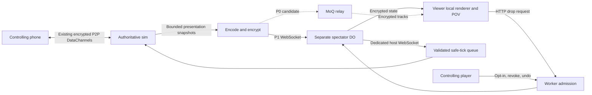

# Spectators, state streams and drop-ins

Research, 2026-10-01. **Access date for every external citation: 2026-10-01.** Estimates/targets are proposals, not network measurements or shipped features.

## Summary and recommendation

Start with our own MIT WebSocket spectator fan-out in a separate Cloudflare Durable Object (DO). Spike MoQ alongside it; adopt MoQ only after interoperability, privacy and cost gates pass. Publish presentation state once; each viewer renders locally and chooses free camera or any offered seat/camera. Keep drop-ins on a separate Worker HTTP/host WebSocket path.

Phone control remains peer-to-peer, end-to-end encrypted WebRTC DataChannels and the offline direct code. Spectators never become controller participants. Channels share CPU/uplink: bounded work and automatic viewing suspension must protect control. Separation alone does not prevent contention.

## 1. MoQ today

The latest verified [moq-transport is draft-21](https://datatracker.ietf.org/doc/draft-ietf-moq-transport/), published 2026-09-08, expiring 2027-03-12. It is an Internet-Draft, not an RFC; it supports generic objects over QUIC/WebTransport, including relays. [Its change log](https://www.ietf.org/archive/id/draft-ietf-moq-transport-21.html#name-change-log) distinguishes editorial 20→21 changes from breaking changes: 17→18 splits namespace/track subscriptions and replaces PUBLISH_OK; 19→20 replaces joining FETCH with subscription fills and changes filter encoding. These affect negotiation, parsing, discovery and reconnect/bootstrap. Pin client, relay and wire version; maintain fixtures for upgrades.

The [old catalogformat-01](https://datatracker.ietf.org/doc/draft-ietf-moq-catalogformat/) is expired/dead (revision 2024-07-08). Current drafts: [MSF-01](https://datatracker.ietf.org/doc/draft-ietf-moq-msf/) (2026-06-02), including a JSON catalog; [LOC-04](https://datatracker.ietf.org/doc/draft-ietf-moq-loc/) (2026-07-20) for encoded/encrypted media; [CMSF-01](https://datatracker.ietf.org/doc/draft-ietf-moq-cmsf/) (2026-06-03) for CMAF packaging. Version our state schema independently; it needs neither video container. MSF/hang catalogs describe tracks; our POV manifest describes local cameras.

## 2. Browsers and devices

API availability is not tested MoQ interoperability. [Compatibility data](https://raw.githubusercontent.com/mdn/browser-compat-data/main/api/WebTransport.json) reports Chrome/Edge 97, Firefox 114 and Safari/iOS Safari 26.4. Release evidence:

| Browser | Version/date evidence | Proposed route |
|---|---|---|
| Desktop Chrome | [97, 2022-01-04](https://chromereleases.googleblog.com/2022/01/stable-channel-update-for-desktop.html); [API announcement](https://developer.chrome.com/blog/new-in-chrome-97) | Probe WebTransport, then WebSocket |
| Desktop Edge | [97, 2022-01-06](https://learn.microsoft.com/en-us/deployedge/microsoft-edge-relnote-archive-stable-channel), compatibility data above | Same |
| Android Chrome | [97, 2022-01-04](https://chromereleases.googleblog.com/2022/01/chrome-for-android-update.html), compatibility data above | Same; measure background/thermal effects |
| Firefox | [114, 2023-06-06](https://developer.mozilla.org/en-US/docs/Mozilla/Firefox/Releases/114) | Client-specific fallback below |
| Safari, iOS Safari | [26.4, 2026-03-24](https://webkit.org/blog/17862/webkit-features-for-safari-26-4/) | WebSocket initially |
| Quest Browser | [146.0, 2026-04-21, Chromium 146](https://developers.meta.com/horizon/downloads/package/browser/146.0/?view=full_width) | Support inferred from Chromium; minimum Quest version/date and physical MoQ test **unverified** |

The [moq-dev client documents](https://doc.moq.dev/concept/transport) WebSocket use for Safari and Firefox before 153 despite earlier API availability; release availability of that Firefox threshold is unverified here. Its QMux WebSocket fallback requires a compatible relay, not merely WebSocket support. Cloudflare's managed MoQ fallback compatibility is unverified. Always retain our own DO fallback, including UDP-blocked networks; switch within a proposed two-second connection deadline. Require HTTPS, Streams, Web Crypto and local 3D rendering; detect WebXR separately. State viewing needs no WebCodecs, media capture or microphone permission. Physical device tests remain outstanding.

## 3. Implementations and Cloudflare offering

| Implementation | License, draft, activity/maturity and hosting |
|---|---|
| kixelated moq-rs/moq-js successors | [moq-rs redirects to moq-dev/moq](https://github.com/kixelated/moq-rs); [old moq-js is deprecated](https://github.com/kixelated/moq-js). Current Rust/TypeScript libraries and relay are [MIT OR Apache-2.0](https://github.com/moq-dev/moq), excluding the separately licensed GPL OBS plugin. [Standards docs](https://doc.moq.dev/concept/standard) advertise drafts 14–22 plus moq-lite; draft-22 publication/interoperability is **unverified** against the tracker above. [September 23 releases](https://doc.moq.dev/setup/upgrade) include @moq/net 0.4.0 and relay 0.15.1, with breaking API/auth changes. Active, usable for a pinned spike; self-hostable. |
| Cloudflare moq-rs fork | [MIT OR Apache-2.0, draft-16 main, draft-14 branch, draft-18 development](https://github.com/cloudflare/moq-rs/blob/main/README.md). Samples are explicitly for testing/development, despite a “production-ready” relay label elsewhere in that README. [July 31 releases](https://github.com/cloudflare/moq-rs/releases) include transport 0.16.1 and relay 0.7.25. Self-hostable native Rust relay; no browser bundle. |
| video-dev moq-js | [MIT OR Apache-2.0 browser player](https://github.com/video-dev/moq-js), with WebTransport/WebCodecs. No relay; pair with an external relay. Exact current draft and release cadence **unverified**; media-focused, not our preferred state client. |
| Meta moxygen | Current [LICENSE is Apache-2.0](https://github.com/facebookexperimental/moxygen/blob/main/LICENSE), correcting stale MIT search snippets. [README](https://github.com/facebookexperimental/moxygen) supports 16 and experimental 18, deprecates 14/15; conformance/interop CI and internal-to-GitHub development show activity. Native C++ self-hosted relay, including Docker; experimental interop is not production proof. Browser companion [moq-encoder-player](https://github.com/facebookexperimental/moq-encoder-player) targets 18 and explicitly lacks production optimization. |

Browser download size is **unverified** for @moq/net, video-dev's player and Meta's companion. P0 measures transport-only minified gzip bytes, excluding existing three.js/assets; target ≤60 KiB. Retain license/NOTICE obligations, audit transitive licenses and avoid GPL components.

[Cloudflare's relay](https://developers.cloudflare.com/moq/) is dashboard/API-accessible and free during beta, advertising globally deployed drafts 14/16 and draft-18 testing. Tokens separate publish/subscribe operations; draft-16 puts tokens in URL paths, visible in access logs. [Feature matrix](https://developers.cloudflare.com/moq/feature-matrix/) lacks FETCH, GOAWAY and SUBSCRIBE_UPDATE. Capacity quotas, retention, geographic guarantees, SLA and post-beta price are **unverified**, not unlimited. Public relay implementation source exists in the fork; the managed service/deployment is not thereby open source. [Self-serve beta terms §5](https://www.cloudflare.com/terms/) say testing-only, possible additional signup terms, no support obligation and possible discontinuation. MoQ-specific signup terms are unverified; review before adoption.

## 4. State and any available POV

Repository evidence: [captureDevice/applyDevice](../src/sim/vr/snapshot.ts) whitelist presentation fields and preserve view-held references. [SharedPresence](../src/sim/vr/presence.ts) sends snapshots every 50 ms, including bodies, people and colors. [Device guests](../src/sim/devices/main.ts) skip logic stepping; [pendulum renderState](../src/sim/devices/pendulum.ts) preserves host-applied state rather than advancing the guest clock. Reuse that presentation path, not its guest input/claim/grab/Stop permissions.

Payload evidence at this lane's base: UTF-8 JSON.stringify, without envelope, props/presence or transport overhead; sizes vary with numeric text. Measurement recipe/results are ignored `artifacts/moq-research/measure.mjs` and `snapshot-sizes.json`.

| Family | Code-derived payload | At 20 Hz, payload kbit/s |
|---|---|---:|
| Arm | [main capture](../src/sim/arm/main.ts): two six-value arms, 12 blocks × position3/quaternion4. Reconstructed default geometry/home values: 909 B, not a browser capture | 145 |
| Humanoid | [debug snapshot](../src/sim/humanoid/main.ts) is not a shared adapter. Proposed two-actor q/position/yaw subset: 1,412 B neutral JSON; [profile](../src/sim/humanoid/profile.ts) has 32 joints/actor | 226 |
| Kart | [four units](../src/sim/devices/kart.ts), 12 scalars/unit: measured initial/rest 459 B | 73 |
| Pendulum | Three units, seven fields including traces: measured initial 267 B; after 12 s at 60 Hz with initial omega 1/1.2/1.4, 18,563 B and 900 trace samples | 43 / 2,970 |

Active decimal values grow JSON. Humanoid also needs final tendon pose, root offset, finger grip and profile identity; omit owners, saved calibration and raw body/hand input. Binary fixed-order float32 estimates before headers: arm 384 B, humanoid ≥288 B (64 angles + roots/yaw), kart 192 B. Proposed ordinary-state budgets at 20 Hz: arm 100, humanoid 100, kart 50, pendulum 40 kbit/s, including encryption/envelopes; validate, do not advertise. Send pendulum traces incrementally at 30 Hz with bounded bootstrap. Drop-ins add budget; cap total publication at 200 kbit/s and reduce cadence under pressure.

For comparison, assuming video at 2–6 Mbit/s, ordinary state targets are 20–150 times smaller; this is an assumed encoder budget, not a measured codec result. Video fixes the transmitted viewpoint and requires encoding; state requires matching local assets and adequate GPU performance.

Publish an encrypted `scene` manifest: schema/build/asset hashes, coordinate convention, offered POV IDs/names and track descriptions. [POV tests](../tests/sim-pov.test.ts) require one finite +Z anchor/seat; [rigs](../src/sim/vr/rigs.ts) flip to camera −Z and expose cockpit/chase, lens/operator, table seats and arm operator/wrist views. Derive these locally from state; do not multiply streams by viewer POV. Humanoid needs its own advertised anchors. Free orbit remains viewer-local. Reuse family viewpoint row, glass panels, typography, focus states and comfort settings; unsupported views are absent.

Tracks carry epoch, sequence, tick, monotonic time, keyframe/base IDs and bounded state/props. One-second groups start with checkpoints; interpolate 100–200 ms behind. Reject asset/schema mismatches and invalid bounds. Keep latest data ≤2 s; checkpoints avoid FETCH. For WS, limit unacknowledged output to 64 KiB/viewer, acknowledge every 2 s and disconnect slow consumers. Lag >500 ms freezes with a waiting label; reconnect takes the latest checkpoint without stepping physics or rearming.

## 5. Non-realtime drop-ins

Use spectator HTTP → Worker/DO → dedicated host WebSocket. A MoQ request track is possible but adds publish permissions and reliable request semantics; HTTP provides clearer acknowledgments. Neither route touches pairing/control channels.

Drop-ins default off. Controller enables a bounded catalog of our own blocks/balls/cones, with per-family legal zones. Request includes capability, epoch, idempotency ID, asset ID and placement; ≤1 KiB, no text or uploads. DO checks token/size/rate; host checks finite coordinates, asset/scene compatibility, collision clearance and budgets again. Host queues at most eight, expires requests after five seconds, and commits at the next safe fixed tick; busy/grasped zones defer or reject. Never mutate during control processing. Disable drop-ins for hardware-connected scenes.

Proposed limits: one request/viewer/10 s, burst two; room maximum two/s; live extra props arm 8, humanoid 8, kart 12, pendulum 4. Catalog physics caps mass/speed/lifetime (60 s). Use short-lived capabilities and ten-minute salted address buckets only in memory, no tracking identifiers. Shared networks may be throttled; new identities bypass individual limits, so room budgets, host approval, mute/revoke and off switch remain essential.

Acknowledgments distinguish queued, placed and rejected. Host assigns stable object IDs; state checkpoints/deltas include asset, pose, lifetime and removal tombstones. Controller can undo by ID or clear all via the separate spectator-management endpoint, removing at a safe tick and canceling pending requests. Undo removes props, not resulting physics/history. Deduplicate for two minutes; stale epochs/reconnects cannot replay requests. Disable placement while behind; never silently retry an uncertain placement with a new ID.

## 6. Privacy, keys and copy

Transport encryption ends at a relay: it sees payload without application encryption, plus addresses, tokens, track names, timing and sizes. [Secure Objects-01](https://datatracker.ietf.org/doc/draft-ietf-moq-secure-objects/) proposes SFrame-derived E2EE and leaves key management to applications. Its interoperability is unverified here. Prefer a reviewed, versioned application AEAD envelope shared by WS/MoQ; use fresh epoch/track keys, unique nonces and replay bounds. Host signatures are also needed: viewers holding a group encryption key must not gain host-forgery authority.

Controller explicitly starts viewing and mints a separate high-entropy watch capability, encryption key and host verification key in the link fragment; strip after import and set no-referrer. Never reuse pairing secrets. Default link life one hour; scoped viewer leases expire within 60 s. Stop/revoke closes admission/sockets, clears cached state and rotates epochs/keys. Revoking one viewer requires fresh keys distributed only to retained capabilities; a shared invite otherwise requires revoking everyone. Previous recipients can retain or redistribute what they saw. Encrypt drop-in bodies to the host if placement privacy is required; DO can still enforce opaque size/rate limits.

Omit camera/microphone imagery, calibration and personal motion/presence unless separately opted in. No accounts, analytics, directory or durable spectator history; transient abuse counters are operational limits. Provider metadata/log retention must be verified before claiming otherwise. Proposed copy: “Watch this shared sim. Choose an available view. Object requests wait for the player’s sim.” State relay metadata visibility and expiry. Claim payload E2EE only after verification; never “anonymous,” “zero latency” or guaranteed uninterrupted control.

## 7–8. Stack, costs and alternatives

[Workers protocols](https://developers.cloudflare.com/workers/reference/protocols/) expose HTTP/WebSockets, but no documented application WebTransport/UDP listener: HTTP/3 ingress alone does not supply a MoQ relay. Native Rust/C++ needs separate hosting or the managed relay. DO can serve admission, fallback and drop-in queues. Keep it separate from [Room](../worker/index.ts), which limits device participants to eight; extend sharing with distinct “Watch” and “Invite controller” actions.

Budget: one sim, 100 kbit/s/viewer, one hour/day ×30 days, decimal GB; excludes assets, overhead, abuse and taxes. [DO pricing](https://developers.cloudflare.com/durable-objects/platform/pricing/) includes 1M requests and 400,000 GB-s/month, then $0.15/M and $12.50/M GB-s; incoming WS messages count 20:1, outgoing messages are uncharged. [Workers pricing](https://developers.cloudflare.com/workers/platform/pricing/) has a $5/month paid minimum and no egress charge.

| Spectators | State GB/month | One DO model | Managed MoQ beta | Realtime SFU egress |
|---:|---:|---:|---:|---:|
| 10 | 45 | $5 total / $0 marginal | $0 relay | $0 ($2.25 gross) |
| 100 | 450 | $5 / $0 | $0 | $0 ($22.50 gross) |
| 1,000 | 4,500 | $5.30 / $0.30, capacity unverified | $0, quota unverified | $175 ($225 gross) |

DO arithmetic: host messages/20=108,000 requests; viewer acknowledgments add 2,700/viewer, plus one join/day. At 1,000 viewers: 2.838M requests, 1.838M over allowance rounded to 2M ($0.30); active duration 13,824 GB-s. Assumes unused account allowances, one DO, no storage. Sharding multiplies duration. [Single-threaded/1,000 requests/s soft limit](https://developers.cloudflare.com/durable-objects/platform/limits/) is not proof of 20,000 outgoing sends/s; stagger acknowledgments and measure before raising caps. Self-hosted MoQ cost = hosting + GB × provider egress rate; quote unverified.

[Realtime SFU/TURN](https://developers.cloudflare.com/realtime/sfu/platform/pricing/) charges $0.05/GB after a shared 1,000 GB/month allowance; existing TURN consumes it. [SFU DataChannels](https://developers.cloudflare.com/realtime/sfu/features/datachannels/) support named fan-out. Good alternative for partial reliability; adds peer negotiation. An open implementation such as [mediasoup (ISC)](https://github.com/versatica/mediasoup/blob/v3/LICENSE) needs separate operations; managed SFU source availability is unverified. [RealtimeKit](https://developers.cloudflare.com/realtime/realtimekit/) adds meeting participants/UI, unnecessary here. [Stream](https://developers.cloudflare.com/stream/pricing/) bills video minutes, not state; it cannot provide local arbitrary POV. WS has TCP backlog risk; MoQ offers independently cancelable groups but introduces draft/client churn and relay dependency. P0 compares WS/MoQ; P1/P2 use WS; P3 uses the proved transport. Promote MoQ only if measured loss recovery/scale benefits justify it.

## Phases and gates

All numbers below are acceptance targets.

| Phase | Scope and acceptance | Risk / relative size / stage |
|---|---|---|
| P0 spike | Pinned WS/MoQ adapters, no public feature. Measure four families, addon ≤60 KiB gzip, 10/100/1,000 synthetic viewers for 30 min; loss 1%/5%, RTT 50/150 ms. p95 state age ≤300 ms, reconnect ≤2 s; control p99 increase ≤2 ms, zero spectator-triggered control disconnects. Prove fallback, nonce uniqueness, signature/replay rejection and relay ciphertext. | Interop/provider/device unknowns. M; Codex lane, Astra reviews security/scale evidence. |
| P1 viewing | First arm/kart/pendulum, then humanoid adapter. Every advertised POV finite and independently selectable; two viewers choose different seats without changing host view. Cap 100 viewers until scale proof. 20 Hz target, ≤200 kbit/s total, ≤1 ms p95 main-thread capture. Latest-only buffers ≤2 s; expiry/revoke ≤2 s; mismatch fails closed. Suspend streaming when control budget fails. Physical Chrome/Edge/Firefox/Android/iOS/Quest matrix; no new sensor permission. | Adapter completeness, thermal/uplink contention, key lifecycle. L; Astra architecture stage, scoped Codex family/UI lanes. |
| P2 drop-ins | HTTP flow, bounded assets/budgets, undo and moderation. 1,000 malformed/stale/duplicate requests produce zero unauthorized placements; queue ≤8; placement ≤1 s when safe, otherwise expires at 5 s. Undo ≤1 s when safe; hardware scenes reject all. Repeat P0 control gates under abuse. | Safe placement/undo physics and capability abuse. L; Astra authority review, Codex per-sim lanes. |
| P3 optional AR dots | Separate opt-in, bounded synthetic dots in sim coordinates, no room scan/raw camera stream. ≤256 dots at 10 Hz, ≤100 kbit/s, ≤300 ms p95 age, reconnect ≤2 s; rerun control/privacy gates on physical XR hardware. | Origin alignment, sensitive derived geometry, battery. M–L; Astra feasibility stage, Codex only after contract. |

## Owner decisions

1. Approve WS-first with a measured MoQ promotion gate?
2. Accept shared-link whole-room revocation initially, or require individual viewer invitations?
3. Approve drop-ins off by default, host approval, listed budgets and hardware exclusion?
4. Permit a managed MoQ beta after terms/privacy review, or require a self-hosted open relay?
5. Keep AR dots deferred until physical XR evidence and a separate privacy contract?
