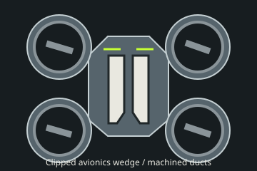
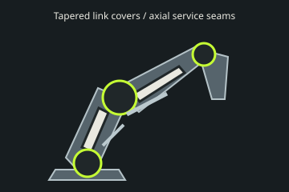
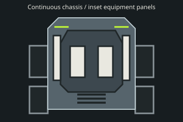

# ob.Pal in three dimensions

Round four proposal: **precise edges, smooth metal**. Each cover explains the machine beneath it. Angular housings, restrained white insets and exposed mechanisms form one family with the surrounding scene. This is an original industrial language, not a reference character or vehicle.

## Edge rules

Dimensions are in the authored model's metre coordinate system, before its existing uniform device scale. Environment dimensions are world metres. Use exactly two edge treatments:

| Name | Chamfer | Use |
| --- | --- | --- |
| **Detail** | **0.5 mm**, 45° | Plate rims, insets, vanes, small fittings and light recesses. |
| **Housing** | **2 mm**, 45° | Load-bearing enclosures, chassis, base, floor tiles, ramp decks and barrier housings. |

Broad faces stay planar or follow one deliberate cylindrical surface; never average their normals across a hard corner. Plan-view plate corners are at least 60°. Distinct structural facets turn by at least 15°; use a single plane instead of many almost-coplanar facets. Turned bearings, turbine bores, tyres and flexible cables are functional curvature, not rounded armour. No domes, pebbles, inflated shields or repeated oval caps. No grain, scratches or noise maps: satin-to-polished metal carries clean reflections.

## Plate construction

Use trapezoids for tapered links, wedges for noses and shoulders, and clipped hex-derived polygons for service covers. Start with the enclosed part and its clearance, then place the seam along its load axis, access boundary or joint axis. Do not decorate a body with unrelated scales.

The visible recessed seam is **1.5 mm wide and 1 mm deep**, exposing Carbon. A cover sits on a recessed structural ledge; where covers overlap, one has a **3 mm hidden tongue** under the adjacent plate. Visible faces remain separated by the same seam. Ceramic is an inset bordered by metal and a recessed seam, never a floating cap. Repeat only useful features: duct vanes, heat-exchanger slots or two service sections along a long link. Leave the joint volume open.

## Materials and light

Target visible exterior area: **65% metal** (acceptable 60–70%), **20% ceramic** (15–25%), and the remainder Carbon structure, gaps, tyres and optical glass. Judge this in a three-quarter view, not by object count. Polished gunmetal protects the chassis; satin titanium defines adjacent facets; bright steel is confined to machined rims and sliding rods. White ceramic appears only inside service-panel boundaries. Avoid white outer shells and alternating colours on every small plate.

Lime **#C6FF34** is inset and sparse. The drone has two short seam slits and a gimbal status slit; the arm has its existing joint rings; the rover has two nose slits and one scanner ring. Ownership indicators and functional headlights/brake lights retain their existing meanings. Yard light marks gate status and short wall stations, never entire glowing outlines. Parking guides are neutral ceramic inlays.

## Four family motifs

1. A chamfered metal plate, Carbon seam and flush ceramic service inset.
2. A short recessed Lime slit, or a thin ring concentric with a working joint.
3. A visible precision mechanism: bearing race, sliding piston, actuator or restrained cable bundle. Attachments follow actual joint frames.
4. A smooth machined rotor or turbine housing with a continuous bore and deliberate segmented vanes. Curvature belongs to airflow and rotation; mounting arms remain faceted.

| Drone | SO-101 | Rover |
| --- | --- | --- |
|  |  |  |
| A clipped, low avionics wedge connects four machined ducts. Split access insets follow its spine; gimbal and motor mounts remain visible. | Tapered link housings follow each servo axis. Two purposeful service sections replace rows of scales; bearings and telescopic actuators remain exposed. | A continuous angular chassis, wheel-clearance fenders and one low equipment enclosure replace the scalloped shell pile. Inset deck panels explain access to electronics. |

These are original construction drawings. Rendered details and the illustrated edge/plate/material/light page stay in the ignored viewer. No reference geometry, renders, silhouettes, helmets, faces, chest lights or red-and-gold palette enter the project.

## Environments

Apply the same rules to floors, walls, pads, tables and props. Use flush modular floor tiles over a Carbon substrate, metal wall housings with recessed ceramic access strips, wedge ramp decks and chamfered gate columns. Cones retain their useful taper and footprint as clipped square markers with ceramic bands. Maintain all collision boundaries and traversable heights; a visual chamfer must not create an obstacle or change the course. Repeat floor seams as a construction grid. Limit Lime to a few status stations.

Round four applies this to **the rover yard only**. Other scenes remain unchanged until the owner confirms the complete model-and-environment language. The later rollout must include each sim's scene area and props, not just its device.

## Motion and delivery

Keep `src/sim/kit/motion.ts`: critically damped responses in seconds, continuous-input filtering, eased rotor spin-up and suspension settling. Mechanism sleeves stay rigid while rods slide; cable ends stay attached. Never smooth the collision gripper away from its authoritative joint, or weaken deadman, watchdog, limits or emergency stops. Verify starts, reversals and release at 30, 60 and 120 fps, and after a long frame.

`assets/blender/` scripts are the source of truth. Export meshopt GLBs to `public/models/`, with named moving pivots and kit material names. Together the assets stay below 1.5 MB; complete scenes with four active units stay below about 250k submitted triangles and 150 draw calls. No textures are required. Procedural rigs draw immediately and remain functional on download failure. Catalogue models stay procedural. The existing WebAssembly permission remains confined to arm and device pages; Trusted Types and `obpal-templates` remain enforced.

Review `artifacts/codex-style/index.html`: original plus rounds one through four, desktop and phone stills, close-ups, motion, yard comparison and measured budgets. `rules.html` presents construction rules with prototype details. `scripts/style-review.mjs` and `scripts/style-scene.mjs` reproduce evidence; `scripts/style-prototypes.mjs` verifies optional loading and budgets in a temporary folder. Evidence is never committed.
